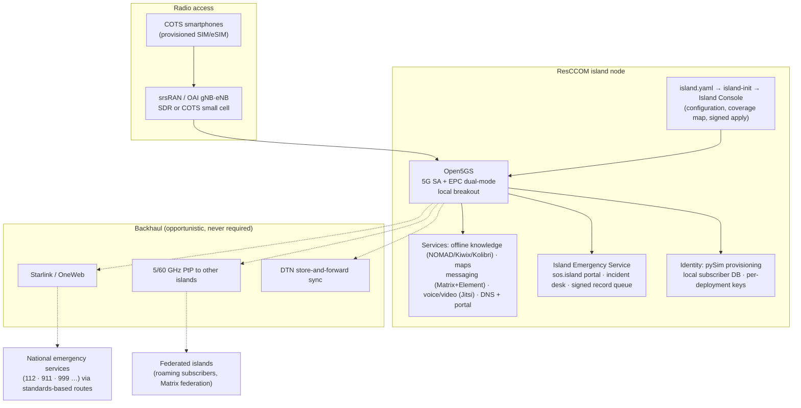

# ResCCOM — Resilient Community & Crisis Communications

**When the towers go down, a community should still be able to talk, find what it needs, and reach emergency services — with the phones already in people's pockets.**

ResCCOM is an open-source cellular network, operated by communities, civil protection agencies, and humanitarian responders, for sudden disasters, protracted crises, and off-grid places. A ResCCOM *island* is a node — backpack, vehicle, or village-scale — that ordinary smartphones attach to over private 4G/5G, exactly as they would to a commercial network. Behind it, local services keep working with **zero internet**: an offline knowledge library, encrypted messaging, voice and video, a status portal, and its own emergency service — a browser-based portal, a local incident desk, and a signed record queue, all fully functional with no link to the outside. When any link to the outside exists — satellite, a radio hop to a neighbouring island — it is used opportunistically to federate islands and to reach the national emergency services (112, 911 and their equivalents), but it is never required.

> ⚠️ **Legal:** radiating on cellular spectrum without authorization is illegal in every jurisdiction. All RF work happens under a test/local license or in a shielded enclosure. Everything else in this repo — the whole software stack — runs in simulation and needs no license. See [SECURITY.md](SECURITY.md) for the project's dual-use rules and the honest threat model.

## Objectives

1. **Native access for the phone people already carry** — no app store, no special hardware: the phone attaches to the island as it would to any network, and every island service, emergency access included, works from its browser.
2. **Fully functional with all backhauls unplugged** — internet only ever *adds* reach. This is tested literally, not assumed.
3. **Owned and operated by local associations** — community networks, preparedness organisations, village cooperatives — never centrally by this project.
4. **Turnkey for volunteers** — a non-expert reaches a verified, non-colliding island through a wizard and a map-based console, not YAML.
5. **Emergency help that works off-grid, and reaches the national emergency services when it can** — every island runs its own emergency service: a browser-based emergency portal (call, text, location — no app store), a local incident desk, and a record queue; when any link exists, sessions are forwarded to the country's emergency call centres through standards-based routes, with explicit degraded modes that never lie to a person in danger. Which routing standards apply is a per-country detail, kept in [RFC-0004](rfcs/rfc-0004-emergency-interop.md), not a dependency of the design.
6. **Islands that federate without a central authority** — subscribers roam between independently owned islands; content and incidents sync when links come and go.

## What exists today, and what doesn't

[](https://github.com/kerbgr/resccom/actions/workflows/ci.yml) — on every push, a plain Linux x86 runner re-runs the unit tests, the `island.yaml` golden rule, and `stack/core/verify.sh` end to end ([the workflow](.github/workflows/ci.yml)); the badge is that run, not a claim.

The single source of truth is [STATUS.md](STATUS.md) — every row cites the verify script or commit that proves it. In one breath: the complete island runs in software on a laptop and passes end-to-end verification (phone-analog attaches, browses the offline library, exchanges E2EE messages, holds a voice call, all with WAN dropped at the host firewall); the 4G and 5G radio paths pass over software radio simulators; subscriber provisioning and the `island.yaml` → console → signed-apply flow exist. **Not yet real:** any RF over an antenna (waits on lab hardware and a license), Starlink measurements, federation, roaming, the Island Emergency Service and its routes to national emergency services, the hardware builds. Designs for those are RFCs, not claims. The public write-up: [docs/poc-writeup.md](docs/poc-writeup.md).

## Try it — the whole island, in about three minutes

```bash
git clone https://github.com/kerbgr/resccom.git && cd resccom
pipx install ./sim-tools ./island-init
./island.sh up              # core + services, secrets generated on first run
stack/services/verify.sh    # simulated phone: attach, library, E2EE chat, voice, portal
```

Docker is the only real prerequisite; the measured timings, the Apple-Silicon notes, and what to do when a check fails are in [QUICKSTART.md](QUICKSTART.md) — the document a newcomer follows cold.

## Find your path

| You are… | Start here | What you can do without radio hardware |
|---|---|---|
| Curious what this is | [docs/poc-writeup.md](docs/poc-writeup.md), then [rfcs/rfc-0001-architecture.md](rfcs/rfc-0001-architecture.md) | Read the evidence, argue with the design (open an RFC) |
| Reproducing it | [QUICKSTART.md](QUICKSTART.md) | Everything; file a [reproduction report](https://github.com/kerbgr/resccom/issues/new?template=repro-report.yml) — the most valuable issue type here |
| Contributing code | [CONTRIBUTING.md](CONTRIBUTING.md) → any `TASKS.md` | The stack, sim-tools, island-init/console, backhaul — all run in simulation |
| A university lab with 4G/5G test capability | [docs/partner-labs.md](docs/partner-labs.md) — run an island, take it to TRL 4, federate with another lab's | Sim path first; the `[HW]` tasks in [stack/ran](stack/ran/TASKS.md) are what your hardware unlocks |
| An association / organiser | [playbook/](playbook/README.md), [docs/deployment-model.md](docs/deployment-model.md) | Country templates, licensing walkthroughs, drills — the most valuable non-technical work |
| A researcher | [rfcs/](rfcs/README.md), [docs/landscape.md](docs/landscape.md) | The open questions in each RFC are research questions |
| A coding agent | [CLAUDE.md](CLAUDE.md) (also [AGENTS.md](AGENTS.md)) | Pick a task from a `TASKS.md`; acceptance criteria decide "done" |

## How the project works

- **RFCs decide, tasks define, status proves.** Design lives in [rfcs/](rfcs/README.md); work is specified as tasks with acceptance criteria in each component's `TASKS.md`; [STATUS.md](STATUS.md) records only what a script or commit proves. Nothing is "done" because someone said so.
- **Verify scripts are the evidence.** Every component ships one; reviews re-run them rather than reading claims.
- **Upstream-first.** Open5GS, srsRAN/OAI, Project NOMAD, pySim, Matrix, Jitsi are consumed as unmodified, version-pinned containers; fixes go upstream; our glue stays thin and Apache-2.0.
- **Honest by rule.** No estimated field numbers presented as measurements, no covertness claims, no security overclaiming — [SECURITY.md](SECURITY.md) is the boundary, including a register of lab-only weaknesses that must never reach a deployment.
- **Tool-assisted, reviewed by re-running.** The maintainer is the author and copyright holder of all project code and documents. Coding agents are used as tools, like a compiler or an IDE, to carry out the task files; they hold no authorship and are not credited as contributors. Nothing is trusted until a review pass re-executes its evidence.

## Architecture



**Design principles** (rationale in [RFC-0001](rfcs/rfc-0001-architecture.md)): offline-first · the phone is the terminal · association-owned · upstream-first · honest threat model · no single-vendor dependency (Starlink, Powerwall and the like are accelerators, never requirements).

## Node classes

| Class | Form | Scenario | Power | Coverage | Users |
|---|---|---|---|---|---|
| **C** | Backpack | Sudden-onset disaster, first hours | ≤30 W battery+solar | ~300–500 m | ~50 |
| **B** | Vehicle / rapid-deploy | Disaster ops, crisis staging | ~150 W | ~1–2 km | ~200 |
| **A** | Community anchor | Off-grid communities, long crises | Solar + battery bank | Village scale | 500+ |

One software image, three hardware profiles → [node-hw/](node-hw/README.md). Coverage and user figures are design targets until measured.

## Repository map

| Path | What |
|---|---|
| [stack/](stack/README.md) | The software stack: core, RAN, services, backhaul, federation (each with `TASKS.md` + verify script) |
| [island-init/](island-init/README.md) | `island.yaml` schema, config rendering, signed wizard, the map-based Island Console |
| [sim-tools/](sim-tools/README.md) | Subscriber & SIM provisioning CLI for volunteers |
| [rfcs/](rfcs/README.md) | Design decisions: architecture, emergency interop, island identity, console |
| [node-hw/](node-hw/README.md) | Hardware reference designs, BOMs, power engineering per node class |
| [playbook/](playbook/README.md) | Deploying as an association: founding, licensing, peacetime operation, drills |
| [docs/](docs/) | PoC write-up, landscape scan, deployment model, spectrum matrix, demo storyboard |
| [QUICKSTART.md](QUICKSTART.md) · [STATUS.md](STATUS.md) · [ROADMAP.md](ROADMAP.md) | Reproduce it · what's proven · where it's going |
| [CLAUDE.md](CLAUDE.md) · [SECURITY.md](SECURITY.md) · [CONTRIBUTING.md](CONTRIBUTING.md) | Agent briefing · threat model & dual-use rules · how to contribute |

## License

Project glue and docs: [Apache-2.0](LICENSE). Upstream components keep their own licenses (Open5GS/srsRAN are AGPL-3.0, consumed as unmodified containers — policy in [CONTRIBUTING.md](CONTRIBUTING.md)).
