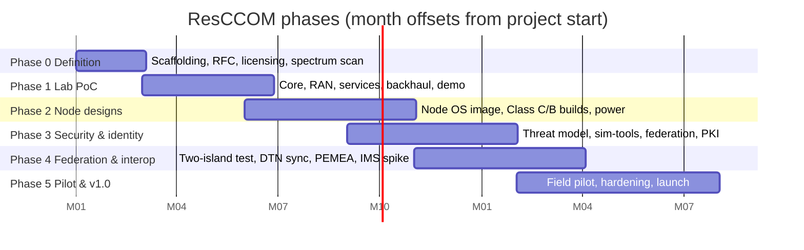

# Roadmap

Six phases, ~18 months from a solo bootstrap to a field-tested v1.0. WBS codes here are the stable identifiers used in issues, commits, and `TASKS.md` files.

## Milestones

- **M1 — Island works (sim):** a simulated UE attaches to Open5GS and uses NOMAD + Matrix with all backhauls down. *(Software-only; the current target.)*
- **M1-RF — Island works (radio):** a COTS phone with a programmed SIM does the same over srsRAN + SDR under a test license.
- **M2 — Reproducible hardware:** Class C and B reference builds documented; someone outside the project reproduces one.
- **M3 — Security baseline:** published threat model; a SIM from island A roams onto island B in the lab.
- **M4 — Interop:** two-island federation live; 112 reachable through a node-hosted PEMEA AP over a live backhaul.
- **M5 — v1.0:** tagged release after a real community deployment.

## Work packages

| WBS | Phase | Work package | Where tracked |
|---|---|---|---|
| 0.1 | 0 | Architecture RFC | [rfcs/rfc-0001](rfcs/rfc-0001-architecture.md) |
| 0.2 | 0 | Licensing & upstream policy | [CONTRIBUTING.md](CONTRIBUTING.md) |
| 0.3 | 0 | Org scaffolding (repo, CI, Matrix space, templates) | this repo |
| 0.4 | 0 | Regulatory/spectrum matrix | [docs/spectrum/](docs/spectrum/README.md) |
| 1.1 | 1 | Core bring-up (Open5GS, compose, UERANSIM verify) | [stack/core/TASKS.md](stack/core/TASKS.md) |
| 1.2 | 1 | RAN bring-up (srsRAN ZMQ → SDR, SIM programming) | [stack/ran/TASKS.md](stack/ran/TASKS.md) |
| 1.3 | 1 | Services (NOMAD, Matrix, Jitsi, DNS/portal) | [stack/services/TASKS.md](stack/services/TASKS.md) |
| 1.4 | 1 | Backhaul module (Starlink, failover, QoS) | [stack/backhaul/TASKS.md](stack/backhaul/TASKS.md) |
| 1.5 | 1 | PoC demo & write-up | — |
| 2.1 | 2 | Node OS image (unattended install, signed) + `island-init` and the Island Console (RFC-0005/0006) | [island-init/TASKS.md](island-init/TASKS.md) (image: node-hw) |
| 2.2–2.4 | 2 | Class C / B / A reference designs | [node-hw/](node-hw/README.md) |
| 2.5 | 2 | Power engineering (solar sizing, battery profiles) | [node-hw/power/](node-hw/power/README.md) |
| 3.1 | 3 | Threat model | [SECURITY.md](SECURITY.md) |
| 3.2 | 3 | Provisioning tooling | [sim-tools/](sim-tools/TASKS.md) |
| 3.3 | 3 | Identity federation & roaming (RFC-0003) | [stack/federation/TASKS.md](stack/federation/TASKS.md) |
| 3.4 | 3 | PKI & secure updates | stack |
| 4.1 | 4 | Two-island exercise (partition drills) | [stack/federation/TASKS.md](stack/federation/TASKS.md) |
| 4.2 | 4 | Delay-tolerant sync | stack/federation |
| 4.3 | 4 | Island emergency service + upstream routes (NG112, PEMEA) — RFC-0004 | stack/services |
| 4.4 | 4 | IMS/VoLTE spike (go/no-go) | rfcs |
| 5.1–5.4 | 5 | Pilot, hardening, v1.0 launch | — |

Cross-cutting from month 0: build in public (monthly dev notes), docs as deliverable of every WP, contributor on-ramps that need no radio hardware.
