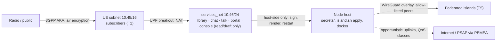

# ResCCOM threat model (WBS 3.1)

**Status:** Draft v0.1, 2026-09-14 — published for review; external security review pending before any field pilot (WBS 5.1). [SECURITY.md](../SECURITY.md) carries the summary, the dual-use rules, and the lab-profile register; this document is the full model behind them.

## 1. What we are protecting, in priority order

| # | Asset | Why it matters | Where it lives |
|---|---|---|---|
| A1 | People's ability to communicate and reach help during a crisis | The point of the project; loss of availability can cost lives | the whole island |
| A2 | Subscriber long-term keys (K/OPc) | Compromise = anyone can impersonate subscribers on any island that trusts the home island | `sim-tools` store (encrypted), SIM cards, home HSS/UDM |
| A3 | The association's signing key and overlay key | Signs `island.yaml` (RFC-0005); identifies the island to peers (RFC-0003) | host-side `secrets/`, never in a container reachable from UEs (2.1-f) |
| A4 | Emergency and incident data (RFC-0004): queued 112 sessions, incident desk records, callers' locations | Sensitive, time-critical, may sit for days before reaching a PSAP | node storage, DTN queues |
| A5 | Location data: LIS geometry, coverage surveys, opt-in civic mapping (RFC-0004 D3, RFC-0006) | Reveals where people and infrastructure are | `island.yaml`, console data |
| A6 | Message and call content | Users assume privacy | Matrix (E2EE), Jitsi (transport-encrypted, not E2E) |
| A7 | Lawful operation | An island radiating unlawfully endangers the association and the project | licensing (WBS 0.4), operator conduct |

## 2. Who we defend against — and who we don't

**In scope (we design against):**

- **T1 Malicious or careless subscriber** on the island: attacks services from the UE subnet, abuses open registration, floods a constrained uplink.
- **T2 Opportunistic attacker in radio range** with commodity equipment: passive capture, rogue base station attempts, denial by RF interference.
- **T3 Criminal exploiting the crisis**: impersonating coordinators or the incident desk, fraudulent "official" messages, theft of nodes.
- **T4 Infrastructure attacker** degrading what the island depends on: backhaul cuts, satellite denial, GNSS/RF jamming.
- **T5 A compromised or hostile neighbouring island** in the federation (RFC-0003): tries to authenticate as our subscribers, harvest IMSIs, pollute shared coverage or content.
- **T6 Supply chain**: a compromised upstream container, image tag, or dependency.
- **T7 Insider**: an operator abusing legitimate access (location data, message metadata, subscriber lists).

**Out of scope for protection, in scope for honesty (RFC-0001 D8):**

- **T8 A state-level or well-resourced adversary.** A radiating cellular network is detectable, direction-findable, and jammable; RF metadata (who attaches where, when) is visible to a capable observer; we cannot hide the network or its users, and we say so on the portal and in every user-facing text. Anyone designing "covert" features here is working on a different project.

## 3. Trust boundaries

The 2.1-f change is the model's most important boundary: **nothing reachable from the UE subnet holds keys or can restart services.** The console edits a draft; signing and apply are host-side acts.

## 4. Threats and mitigations by component

| ID | Threat (actor) | Component | Mitigation today (lab) | Required before deployment |
|---|---|---|---|---|
| M1 | Subscriber impersonation via stolen keys (T2, T5) | core, sim-tools | Encrypted-at-rest store; test vectors only in repo | Association-held passphrase; home key custody in roaming (RFC-0003 D1); SIM programming only from the store |
| M2 | Rogue base station / downgrade (T2) | RAN | 5G AKA is mutual; 4G is vulnerable to IMSI catchers by design | Provision the home-network public key for SUCI (5G); document 4G exposure to users; prefer 5G SA where handsets allow |
| M3 | Service abuse from the UE subnet (T1) | services | Open registration, no rate limits beyond Synapse defaults | Registration gated (invite/token), per-UE rate limits, QoS classes already exist (1.4-c) |
| M4 | Console compromise → node takeover (T1, T3) | island-init/console | Read-only mounts, no docker.sock, operator token, host-side apply (2.1-f) | Real operator auth (WBS 3.4), audit log retention |
| M5 | Impersonating the incident desk or coordinators (T3) | RFC-0004, portal, Matrix | — | Operator identities verified on the portal (signed), incident desk in a restricted Matrix room, playbook trains users what official looks like |
| M6 | Emergency data exposure or loss while queued (T3, T7) | RFC-0004 D2 | — | Signed, encrypted-at-rest queue; retention limits; forwarded and purged on reconnect; access logged |
| M7 | Location data leakage (T5, T7) | LIS, console, `island.yaml`, federation roaming (3.3-c v2h) | Instance outputs gitignored (2.1-g); sharing defaults off (RFC-0006 D5). **New vector, accepted (3.3-c v2h, TASKS.md, RFC-0003 D5, 2026-09-17)**: a visited island now learns which of a peer's subscribers are roaming-enabled (`lbo_roaming_allowed`) at policy-export time, before any of them ever attach — a coarse "who might travel here" signal, not a location history. Mitigated the same way as the rest of this row: export only what's marked roaming-enabled, never the full subscriber set, and nothing beyond session policy (no credential, no usage/location data) | Civic mapping disclosed only inside an active emergency session; coverage sharing opt-in; site coordinates classified sensitive per island; roaming-policy export signed and access-logged per exchange (WBS 3.4, not yet built — see M8's own required-before-deployment column) |
| M8 | Hostile federation peer (T5) | overlay, roaming | Allow-listed WireGuard overlay (3.3-b): only listed islands can connect. Forward-filter in `wg-overlay` (3.3-b follow-up 3, re-narrowed 3.3-c v2) now restricts tunnel-origin traffic to the peer's own SEPP, on its N32-c/N32-f ports only — NRF/AUSF/UDM are no longer reachable from the tunnel at all, tighter than the 5G-only SUPI-range design this replaced (RFC-0003 D1 amendment). The allow-list gates *which islands*, this gates *which service*. HSS (the 4G equivalent) was never in the filter's allow-set: 3.3-d hasn't rendered any Diameter routing over the overlay, so nothing legitimate reaches it that way either — revisit when 3.3-d does. **Live-verified (3.3-c v2, TASKS.md)**: SEPP's own N32-c security association genuinely establishes between two distinct-PLMN islands over the overlay — real working infrastructure, not just config that starts. **Live-verified further (3.3-c v2b, TASKS.md)**: using OpenAirInterface's nrUE (which, unlike UERANSIM, has no PLMN-suitability check) instead of UERANSIM, a genuine roaming Registration Request — correct home-PLMN SUCI, sent on the visited island's cell — does reach the visited AMF, which does correctly trigger SEPP-based home-routed discovery rather than a PLMN-mismatch rejection; two real lab-profile gaps in reaching the home NRF (a missing port on Open5GS's own inter-PLMN discovery client, no local DNS for its synthetic FQDN) were found and fixed, getting the request to a real `200 OK` from the home island's own NRF. **Known gap, localized more precisely (3.3-c v2c, TASKS.md)**: the "200 OK with no AUSF candidate" above was observed via hand-edited config, restarted by hand. Through the real, finished tool (a debug-logging knob added for this, plus three unrelated script/orchestration bugs found and fixed along the way — most notably: an already-running NF never reloads a peer-only config change without an explicit restart, which the harness wasn't doing), the actual behavior is narrower and stranger: the TCP connection between A's SEPP and A's NRF reaches ESTABLISHED on both ends (confirmed live via each container's own `/proc/net/tcp`) and Open5GS's own SBI client reports successful dispatch, but no HTTP/2 exchange ever completes on it — not a rejection, a silent stall, confirmed unchanged 12+ minutes later while the same NRF process demonstrably keeps servicing other NFs throughout. This means the request never reaches NRF's own discovery-handling code at all, ruling out a PLMN/service-name exclusion there specifically. End-to-end home-routed authentication (a UE actually completing registration via a visited island) still can't be demonstrated in the `[SIM]` lab. **Superseded in part (review re-run, 2026-09-16, TASKS.md v2c end)**: on a healthy Docker host the stall did not reproduce; the home-routed discovery completes and returns the home AUSF, whose profile has no FQDN, so the visited AMF dials it directly by IP — and the forward filter blocked that, a live demonstration that a non-SEPP cross-island request does not get through. The remaining defect is this project's IP-based NF addressing (3.3-c v2d), not Open5GS. **Closed (3.3-c v2d, TASKS.md, 2026-09-16): the UE-attach gap this row has tracked since 3.3-c v2 is resolved.** 3GPP-FQDN addressing (NRF/AUSF/UDM/SMF/NSSF) plus `serving:` on AMF/SMF gets the roaming nrUE a real `Registration Accept`; A's AUSF logs genuine `AUTHENTICATION_SUCCESS` for the roaming subscriber; K never left A. Confirms the forward filter's own job description directly: every step of this worked *because* it went through SEPP's allow-listed N32 ports, exactly as this row's own mitigation says should be the only path. **New finding, same session**: Open5GS's own AMF, given the same `serving:` this needed, unconditionally negotiates full 3GPP Home-Routed (not Local Breakout) roaming for the PDU session — confirmed live, the *home* island's own SMF/UPF anchor the session and allocate the UE's IP, not the visited island's. That needs an N9 (UPF↔UPF GTP-U) tunnel this filter does not carry (only SEPP N32 crosses) — so the breakout ping still fails, but now because the filter is *correctly* blocking a data-plane hop this design never intended to need, not because of an addressing defect. RFC-0003 open question 5 tracks the design decision (force LBO if reachable, or extend the filter for N9 with the same care N32 got) — 3.3-c v2e. **Resolved (3.3-c v2e, TASKS.md, 2026-09-16): Local Breakout is the subscriber tooling's job (`resccom-sim` writes `lbo_roaming_allowed`, default `true`), so the filter stays exactly this narrow — N9 is never needed for D1's default path and is not carried; a live end-to-end confirmation of the resulting data plane was blocked this session by an unrelated Docker Desktop WireGuard NAT fault on the host running both islands, not by anything in this filter or the SEPP path it protects.** **The NAT fault is fixed (3.3-c v2e follow-up, WBS 3.3-c v2f, TASKS.md, 2026-09-16)**: `stack/federation/compose.wan.yaml` gives both islands' `wg-overlay` containers a dedicated, statically-addressed bridge instead of reaching each other through Docker Desktop's host-published ports — `two-island.sh verify` now passes `ALL CHECKS PASSED` both directions with no recurrence of the bilateral endpoint-drift symptom, confirmed on two independent runs. Through the fixed overlay, `two-island.sh roam --ue oai` (run twice, identical result both times) now genuinely exercises this filter end to end for the first time: the roaming nrUE gets a real `Registration Accept` with authentication forwarded home via SEPP, and B's own AMF correctly selects Local Breakout (`LBO[1]`, B's own local SMF endpoint set up) — the SEPP path did exactly its job, real traffic crossed only where this filter allows it to. A new, later-stage blocker surfaced immediately past that: B's own local SMF rejects the PDU session establishment itself (a fast, network-failure-free application-level reject, `../src/amf/namf-handler.c:486`, reason not yet captured — the harness doesn't dump B's SMF log and the container is gone before it can be inspected) — a gap in the roaming data-plane setup, not in this filter or in anything the filter protects (the reject happens entirely within B's own `core_net`, never touching the overlay). **Root-caused and closed as a settled negative finding (3.3-c v2g, TASKS.md, 2026-09-17): B's own local PCF rejects the SM Policy Association because Open5GS's PCF reads subscriber data via a direct local MongoDB connection with no N24/SBI path to a foreign PCF at all, entirely outside anything this filter governs.** **Fixed with data, not a workaround, and MILESTONE M3 IS REACHED (3.3-c v2h, TASKS.md, 2026-09-17): the home island exports the roaming subscriber's policy only (no `security` field, refused on import by code) and the visited island imports it as a marked record before the UE attaches -- `./two-island.sh roam --ue oai`, run twice, both times a real `Registration Accept`, Local Breakout PDU session at the visited island's own SMF/UPF, and a real breakout ping completing `0% packet loss`, entirely inside the visited island's own `core_net`, this filter's mitigation untouched and unextended.** Whether Open5GS's own SEPP-side validation (TLS, N32-c capability negotiation) is sufficient against a genuinely malicious peer SEPP is unassessed | `[HW]` phone roaming test (real PLMN selection) as an independent confirmation path, now that the `[SIM]` path (3.3-c v2h) is fully proven; 4G inter-realm roaming (3.3-d); STRIDE pass on SEPP's own N32 handling against a malicious peer; no K at visited (holds -- K never left the home island in any live testing, 3.3-c through 3.3-c v2h, including full authentication and a completed roaming session); a real, signed exchange mechanism for the roaming-policy export (SECURITY.md's lab-profile register -- WBS 3.4, currently an unsigned file hand-over); bounded vector cache; per-peer logging; revocation ceremony |
| M9 | Backhaul denial (T4) | backhaul | Island fully functional offline (1.4-b literal test); multi-uplink failover | Second satellite provider option; drills for partition (playbook) |
| M10 | RF jamming (T2, T4) | RAN | Cannot prevent; portal reports service state truthfully | Site survey for alternative bands; honest user messaging |
| M11 | Compromised upstream image or dependency (T6) | all | Every image and package pinned by tag/version | Signed images and updates (WBS 3.4); digest pinning; reproducible node image (2.1) |
| M12 | Node theft (T3) | node-hw | — | Encrypted disks; secrets on removable token; remote wipe not assumed (offline) |
| M13 | Insider misuse of metadata (T7) | operations | — | Logging of privileged actions; two-operator rule for subscriber export; playbook code of conduct |
| M14 | Unlawful radiation (T7, negligence) | RAN, licensing | Legal warning in every RAN doc; sim path default | License held by the association, recorded in `island.yaml`; drills never radiate without it |

## 5. Accepted disclosures (we tell users these; we do not pretend otherwise)

- The home island learns where its subscribers roam; the visited island learns their IMSI (RFC-0003 D5).
- Operators can see who talks to whom on Matrix (metadata), not content (E2EE). Voice/video is not end-to-end encrypted.
- Attachment to the network is observable over the air by anyone equipped to look (T8).
- In degraded emergency modes, help may be local responders, not 112 — the app and portal say which (RFC-0004 D2).

## 6. Lab-profile register mapping

Every row of [SECURITY.md](../SECURITY.md)'s lab-profile register corresponds to a "required before deployment" cell above (M1, M3, M4, M7, M11 in particular). `island-init`'s production profile (RFC-0005 D1) must refuse to render while any of those rows is unresolved for that island — that check is the enforcement point, not a checklist.

## 7. What must happen before a pilot

1. External review of this document and of the console/apply boundary (2.1-f) by someone outside the project.
2. STRIDE pass per component as each is built for production profile (3.4 PKI, 3.3 overlay, 4.3 PEMEA AP).
3. A tabletop exercise with an association: T3 and T7 scenarios, because those are the ones technology alone does not fix.
