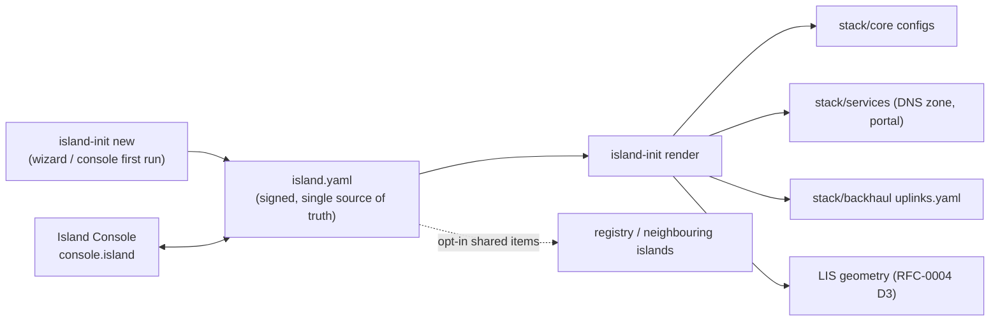

# island-init — one file is the island (WBS 2.1)

`island.yaml` is the single signed description of an island (RFC-0005 D1): identity and allocations, radio sites and cells, services, federation policy. `island-init` is the tooling around it — validate, render every service config from it, bootstrap a new island, and serve the **Island Console**, the map-based web UI that is the operator's face of all this (RFC-0006).

Work is defined in [TASKS.md](TASKS.md). Design authority: [rfcs/rfc-0005](../rfcs/rfc-0005-island-identity.md) (identity, allocations, `island-init`) and [rfcs/rfc-0006](../rfcs/rfc-0006-island-console.md) (console, coverage designer, coordination view). Current state: [STATUS.md](../STATUS.md).



Boundary that must hold (RFC-0006 D5): subscriber keys never pass through here — SIMs and keys stay in [sim-tools](../sim-tools/README.md).

## Status (2.1-a, 2.1-b, 2.1-c, 2.1-f, 2.1-g)

`island_init` is a pipx-installable Python package (like `sim-tools`) with four commands so far:

```sh
island-init check <file>
island-init render (--lab | --file <file>) [--diff] [--repo-root <dir>]
island-init new (--lab | --allocation <file>) [--out <file>] [--secrets-dir <dir>] [--repo-root <dir>]
island-init apply --draft <file> [--island-yaml <file>] [--secrets-dir <dir>] [--repo-root <dir>]
```

`check` validates `<file>` against [`island_init/schemas/island.schema.v0.json`](island_init/schemas/island.schema.v0.json) (JSON Schema draft 2020-12), then — only if the shape validates — against the semantic rules in `island_init/checks.py`:

1. **PCI uniqueness** across every site's cells.
2. **Non-overlapping prefixes** (`allocations.ue_prefix.v4` vs `allocations.services_prefix`).
3. **`profile: production` may not carry lab-only values**: the reserved test PLMN `001/01`, the reserved test IMSI block (`00101…`), a null/placeholder signing key or WireGuard key, a placeholder portal association name/operator contact, or no signature.
4. **A present `signature` block must cryptographically verify** — checked regardless of profile, so tampering even one byte of a signed file's contents makes `check` fail.

Each failure is printed as `<file>:<line>: <field>: <message>` — schema errors first, semantic errors only once the document at least parses cleanly.

[`island.example.yaml`](island.example.yaml) is the current lab profile, kept honest to what's actually configured today: every value cites the real config file it was read from, and fields that genuinely don't exist yet (signing/WireGuard keys, a physical site survey, coverage data) are `null` rather than invented.

`render` runs `check` first, then substitutes only the handful of values RFC-0005 D1 actually assigns per island — PLMN, TAC, UE/services subnets, Diameter realm, DNS zone, backhaul uplinks, portal association info, radio-site geometry — into the existing `stack/core`, `stack/services`, `stack/backhaul` configs via the templates in `island_init/templates/`. Everything else in those files (container-internal addresses, security algorithm orders, comment prose not about a rendered value) is left exactly as committed. `island-init render --lab --repo-root ..` reproduces every already-committed file byte-for-byte (TASKS.md's golden rule) except the "rendered from island.yaml — do not hand-edit" header line each template now carries. `--diff` shows a unified diff without writing.

Two of `render`'s targets are **per-deployment outputs, not shared project state** (2.1-g): `stack/services/data/portal/settings.json` (association name/operator contact — falls back to the pre-2.1-b placeholder text when null, see `stack/services/config/portal/server.py`'s `load_settings()`) and `island-init/data/lis-geometry.json` (RFC-0004 D3's node-config geometry record — a straight projection of `island.yaml`'s `sites[]`, since no LIS consumer exists yet to dictate a different shape). Both render under gitignored `data/` directories rather than tracked `config/` ones: a real island's site coordinates or operator contact must never land in this shared repo's history, and `island.sh apply` (or the Island Console it backs) must never dirty the working tree just because an operator moved a site or renamed their association. `island.sh up` renders both fresh on every boot (`render_instance_outputs`, since the bind-mounted paths must exist before `stack/services` starts) so this holds even on a brand-new checkout. The tracked golden-rule baseline for these two lives at [`island-init/lis-geometry.example.json`](lis-geometry.example.json) and `stack/services/config/portal/settings.example.json` — rendered once from `island.example.yaml` and never touched by `render`/`apply` again; `pytest`'s golden-rule test (`tests/test_render.py`) compares against those instead of the live `data/` output.

**Known limitation (v0):** only a single TAC per island (`tac_range[0] == tac_range[1]`) and only the three uplink names that already have a Docker network in `stack/backhaul/compose.yaml` (`fixed`, `satellite`, `ptp`) — both raise a clear `RenderError` otherwise, rather than guessing.

### Node-internal addressing (3.3-a) — two islands on one host

`node.internal_base` (e.g. `10.10.0.0/16`) is `island.yaml`'s host-local counterpart to `allocations`: not a registry allocation, just this island's own container plumbing. `render`'s `NODE_IP_OFFSETS` (mirroring `SERVICE_IP_OFFSETS`) derives `stack/core/compose.yaml`'s `core_net` (the first `/24` of the base) and every NF's fixed address from it, so `core_net` and every hardcoded `10.10.0.x` NF address are now render targets, not committed literals — a second island with a different `node.internal_base` (e.g. `10.20.0.0/16`) renders a disjoint `core_net` with no template change. `compose.yaml`'s `services_net` name and AMF's published NGAP port are also now env-var-defaulted (`${SERVICES_NET_NAME:-resccom_services_net}`, `${AMF_NGAP_PORT:-38412}`) so two islands' compose projects don't collide on either — both default to today's literal values when unset.

[`island.example.b.yaml`](island.example.b.yaml) is a second lab island fixture for exercising this: same test PLMN as `island.example.yaml` ("island A", RFC-0003 D1), distinct IMSI block/UE prefix/services prefix/DNS zone/`node.internal_base`. Its `realm` deliberately stays `localdomain`, the same as island A — see the fixture's own comment on why (gradiant/open5gs's freeDiameter TLS certs are the upstream image's own fixed self-signed certs, one hostname each; any other realm aborts HSS/MME at startup on their own cert's hostname check). It is **not** rendered by `--lab`; render it explicitly with `--file island.example.b.yaml --repo-root <a second checkout>` — island A and island B cannot both render into the same checkout's `stack/core/`, since each render overwrites the same file paths.

The top-level [`island.sh`](../island.sh) gains `--island <dir>`, to operate against that second checkout as an independent compose project (set `COMPOSE_PROJECT_NAME` before calling so its containers, and `SERVICES_NET_NAME` derived from it, don't collide with island A's).

Verified live (not just rendered): a second local checkout, island B's fixture rendered into it, both islands' `stack/core` brought up simultaneously on one host with distinct `core_net` bridges and no port/subnet collisions — each island's own `stack/core/verify.sh` (which now derives its expected UE/services subnets from the rendered configs, since the script itself is copied unchanged into the second tree) passed while the other island was fully up. See `STATUS.md`'s 3.3 row for the full trace.

`new` builds and signs a fresh `island.yaml` (RFC-0005 D4's wizard flow): `--lab` reproduces `island.example.yaml` exactly except for freshly generated keys, with every prompt skipped; `--allocation <file>` takes a pasted-in registry allocation (no `registry/` repo exists yet — WBS 0.3 follow-up per RFC-0005 D2 — so this is the interim input format: a file shaped like `island.yaml`'s own `allocations` object, see [`island_init/wizard.py`](island_init/wizard.py) and the fixture at `tests/fixtures/allocation.example.yaml`) and interactively prompts for name/country/node class/profile (and, for `profile: production`, the portal association name/operator contact `check` requires). Either way, `new` generates a fresh Ed25519 signing keypair and a WireGuard X25519 keypair (`island_init/crypto.py`), writes the private halves to `secrets/<island id>/{signing,wireguard}.key` (`secrets/` and `*.key` are both already in `.gitignore`), fills in the public halves, and signs the document — a canonical, sorted-key JSON encoding of everything except the `signature` block itself, so re-serializing the YAML doesn't break the signature but changing any value does. `check` verifies that signature whenever one is present, and `profile: production` now requires a valid one.

`apply` (2.1-f, RFC-0006 D5) is the host-side half of the Island Console's Apply flow: it takes a *draft* -- an unsigned candidate document the Console (`stack/services/config/console/server.py`) has already schema/semantic-validated and staged to disk, never island.yaml itself -- re-validates it, signs it with the private key in `--secrets-dir` (which never leaves the host or enters the console container), renders every affected config (`island_init.render.render_all`), writes `island.yaml`, and restarts the containers whose rendered config actually changed (`island_init/apply.py`'s `RESTART_MAP`, via a plain `docker restart` — the host's own Docker, not a socket handed to any container). Run directly or via the top-level [`island.sh apply`](../island.sh), which points it at the Console's staged draft (`stack/services/data/console/draft.yaml`) and needs no other arguments. See [`island_init/apply.py`](island_init/apply.py) and `stack/services/README.md`'s "Island Console" section for the full split.

Install for development:

```sh
cd island-init && python3 -m venv .venv && source .venv/bin/activate
pip install -e ".[dev]"
pytest
```

**`island.sh` runs the pipx-installed `island-init`, not this checkout's source.** After editing anything under `island_init/`, `pipx install --force ./island-init` before running `island.sh up`/`apply` again, or they'll silently exercise the old code (found the hard way during 2.1-g: a stale install re-rendered the pre-2.1-g target paths and dirtied the tree the new code was supposed to leave clean).

## Measured timing (RFC-0005 D4's < 30 min target)

Run 2026-09-13, one command at a time, from a running-stack teardown (`./island.sh down`, matching [QUICKSTART.md](../QUICKSTART.md)'s methodology) — macOS, Apple Silicon, Docker Desktop, images already present in the local Docker cache from prior pulls (excludes first-time image pull, same caveat as QUICKSTART.md):

```sh
island-init new --lab --repo-root .
island-init render --file island-init/island.yaml --repo-root .
./island.sh up
./stack/services/verify.sh
```

| Step | Wall time |
|---|---|
| `island-init new --lab` | 0s |
| `island-init render --file island-init/island.yaml` | 1s |
| `./island.sh up` | 1m 51s |
| `stack/services/verify.sh` | 43s |
| **Total, `new` → fully verified** | **2m 35s** (plus first-time image pull) |

Comfortably inside RFC-0005 D4's 30-minute target — for the `--lab` path specifically. This is not yet the full "association volunteer with a real registry allocation" rehearsal RFC-0005 D4 describes: that needs a `registry/` repo that doesn't exist yet (see `--allocation`'s note above) and a human actually running the interactive prompts, neither of which this automated run exercises.

## Versions

| Component | Pin |
|---|---|
| Python | >=3.11 |
| click | 8.1.8 |
| jsonschema | 4.23.0 |
| ruamel.yaml | 0.18.6 |
| jinja2 | 3.1.6 |
| cryptography | 50.0.1 |
| pytest (dev) | 8.4.2 |
| `island.yaml` schema | v0 (`island_init/schemas/island.schema.v0.json`) |
