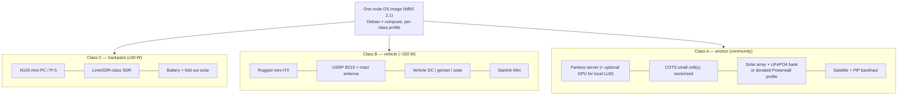

# node-hw — hardware reference designs (WBS 2.x)

Three node classes, one software image (RFC-0001 D9). Each class dir holds `BOM.md` (parts, sources, prices — all prices `<!-- VERIFY -->` until quoted), build notes, and a field-setup guide. Nothing here is built yet; BOMs start as engineering targets.

| | Class C | Class B | Class A |
|---|---|---|---|
| Scenario | First hours of a disaster | Rapid-deploy ops | Permanent community anchor |
| Setup time target | 15 min, one person | 4 h, two people | Planned install |
| Power budget | ≤30 W | ~150 W | Sized per site ([power/](power/README.md)) |
| Radio | Low-cost SDR, low EIRP | B210 + mast | COTS small cells |
| Services | Matrix, maps, portal | Full minus GPU LLM | Everything + PEMEA AP + federation hub |
| Dir | [class-c-backpack/](class-c-backpack/BOM.md) | [class-b-vehicle/](class-b-vehicle/BOM.md) | [class-a-anchor/](class-a-anchor/BOM.md) |

**Order of work:** power engineering ([power/](power/README.md)) and Class C BOM first — Class C is the cheapest to get wrong and the most constrained, so it disciplines the image (WBS 2.1). Class A stays a paper design until a pilot partner exists (WBS 5.1).
