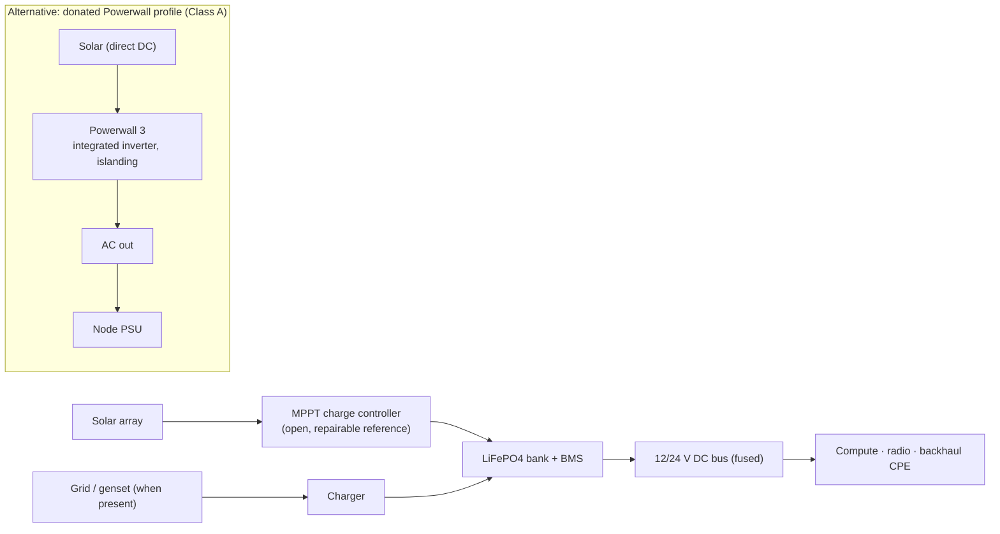

# Power engineering (WBS 2.5)

Shared power design across node classes: 12/24 V DC bus conventions, solar sizing, battery profiles. Rule of thumb structure below; every number feeding a BOM must eventually come from measurement.

## Sizing method

For a node with continuous draw `P` (W), autonomy target `T` (h, no sun), and worst-month peak-sun-hours `H` at the deployment latitude:

- Battery (Wh) ≥ `P × T / DoD` — LiFePO₄ usable depth-of-discharge ~0.8.
- Solar (W) ≥ `P × 24 / (H × η)` — system efficiency `η` ≈ 0.7.

Worked example, Class A at 300 W in a Nordic winter (`H ≈ 1` <!-- VERIFY per site; northern winters may force genset/wind hybrid -->): battery for 24 h autonomy ≈ 9 kWh; solar "self-sufficient" sizing goes absurd (≈10 kW) → Nordic Class A designs plan **grid/genset-assisted winter + solar-dominant summer**, and the docs must say so honestly rather than promise year-round solar autonomy at 60°N.

## Profiles

| Profile | Classes | Notes |
|---|---|---|
| **Open reference** (LiFePO₄ + Victron-class MPPT) | C, B, A | Repairable, sourceable anywhere; the design of record |
| **Powerwall** (donated units) | A | Integrated solar inverter + islanding = fast community starts. **Dumb-mode rule (RFC-0001 D10):** node treats it as an AC source; zero operational dependency on Tesla cloud/app. Not field-repairable — document the month-8-of-a-crisis implication |
| **Vehicle DC** | B | 12/24 V input, ignition-off protection, genset input documented |

## Measured budgets (empty until hardware exists — no estimates promoted to fact)

| Class | Component draws (measured) | Total | Date/setup |
|---|---|---|---|
| C | — | — | — |
| B | — | — | — |
| A | — | — | — |
