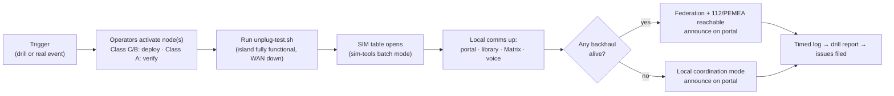

# Community playbook — deploying ResCCOM as an association

The unit of deployment is a **local legal association** (community network, civil-preparedness org, village cooperative), never an individual: the association holds the spectrum license, owns the hardware, and keeps the subscriber keys (RFC-0001 D7). This playbook is written for organizers and volunteers, not engineers.

Each section below becomes its own doc as it's written. Contributors who know their country's association law and volunteer structures: this is the most valuable non-technical work in the project.

## Sections to write

1. **Founding the association** (`association.md`) — model statutes for a network-operating nonprofit; existing patterns to copy: Freifunk e.V. (DE), guifi.net commons agreement (ES), Danish antenna associations, Sarantaporo.gr (GR). Country templates: DE, DK, SE, FI, NO, GR first. <!-- VERIFY each country's association/licensing interplay -->
2. **Getting spectrum** (`licensing.md`) — country-by-country walkthrough of local/test license applications, building on the [spectrum matrix](../docs/spectrum/README.md); who applies, what it costs, how long it takes, renewal.
3. **Peacetime operation** (`peacetime.md`) — what the network does between crises (community Wi-Fi, offline library, local chat), because a network first switched on during a disaster will not work; funding via membership fees; the volunteer roles (2–3 trained operators minimum).
4. **Drills** (`drills.md`) — the activation exercise, run at least twice a year:

5. **Crisis handbook** (`crisis.md`) — one laminated page per node class: activation steps, safety, what to tell neighbors, what the network can and cannot do (**copy constraints: [SECURITY.md](../SECURITY.md)** — no covertness claims to people in danger).
6. **Working with authorities** (`authorities.md`) — municipalities, civil-protection agencies (MSB-style), 112 authorities for PEMEA interop; being a registered, licensed, drilled association is what makes authorities cooperate.
