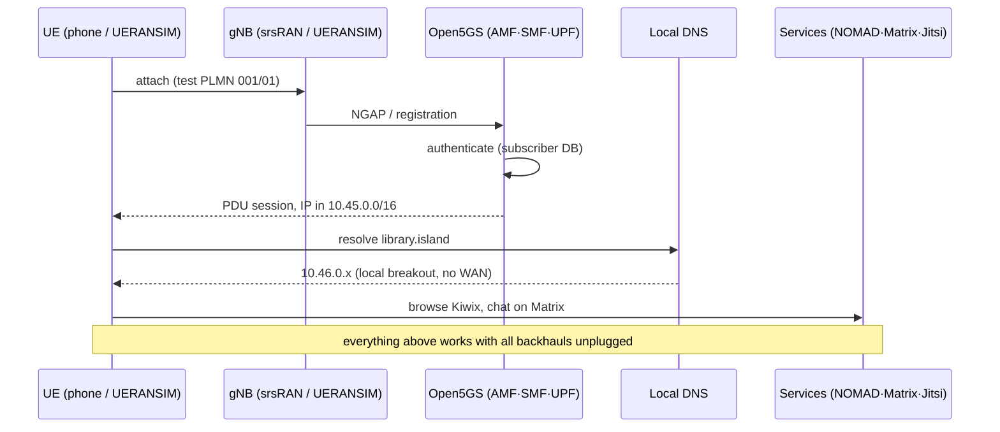

# stack/ — the ResCCOM software stack

Everything needed to turn a Debian box into an island. Components deploy as version-pinned upstream containers glued by compose files and small scripts (see [CLAUDE.md](../CLAUDE.md) for conventions: subnets, test PLMN, `.island` DNS zone).

## Development without radio hardware (the default)

The entire stack is developed and verified in software: **UERANSIM** simulates gNB+UE against the real Open5GS core, and **srsRAN's ZMQ virtual radio** replaces the SDR for RAN work. Real RF (`[HW]` tasks) only ever reproduces what already passes in simulation.

## Components and order of attack

| Dir | What | Depends on |
|---|---|---|
| [core/](core/TASKS.md) | Open5GS 5GC+EPC under compose, UERANSIM verification (start here) | — |
| [services/](services/TASKS.md) | NOMAD, Matrix, Jitsi, DNS, captive portal (next) | core |
| [ran/](ran/TASKS.md) | srsRAN: ZMQ virtual radio, then SDR `[HW]` (after services) | core |
| [backhaul/](backhaul/TASKS.md) | WAN failover, QoS, the unplug test (after services) | core, services |
| [federation/](federation/README.md) | Inter-island overlay, roaming, DTN sync | all |

Milestone **M1 (sim)** = `core` + `services` acceptance criteria all passing on one machine. Current state of every component: [STATUS.md](../STATUS.md).
