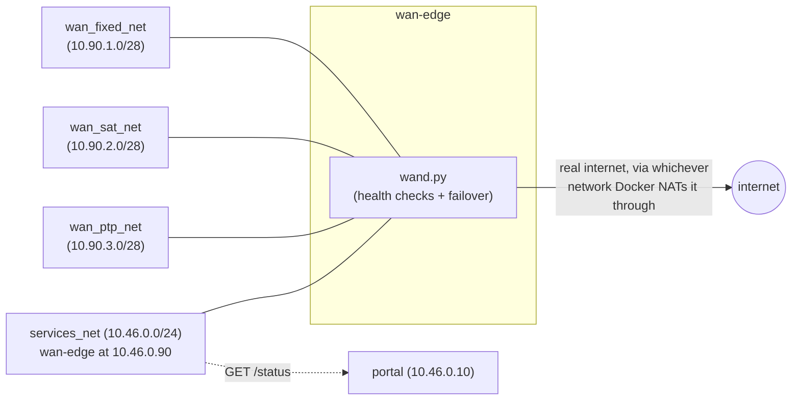
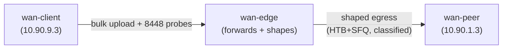

# stack/backhaul — WAN uplink abstraction & failover (1.4-a, 1.4-b, 1.4-c)

`wan-edge`: a small router that holds any number of priority-ordered WAN
uplinks, health-checks each one continuously, and keeps a live default
route pointed at the best *healthy* one — the opportunistic-WAN half of
[RFC-0001 D5](../../rfcs/rfc-0001-architecture.md) ("unplugging every WAN
changes reach, never function"). `unplug-test.sh` (1.4-b) is the standing
proof of that rule for the whole island, not just this module — the
repo's first literal "drop all WAN routes and confirm nothing breaks"
test. `wand.py` also now shapes each uplink's own egress so emergency and
operational-coordination traffic doesn't get starved by bulk traffic on a
constrained link (1.4-c). 1.4-d (`[HW]` Starlink profile) stays open —
no real terminal is available to measure against, so per CLAUDE.md this
isn't simulated toward "done"; see
[starlink-profile.md](starlink-profile.md) for the paper design that's
ready for when one is, [TASKS.md](TASKS.md) and
[../../STATUS.md](../../STATUS.md).

## Why containers, not real interfaces

TASKS.md's acceptance criteria call for "two simulated uplinks
(netns/veth is fine)". On a bare-metal Debian/Ubuntu node — the actual
deployment target (CLAUDE.md) — this module's failover logic
(`config/wand.py`) would run directly on the host against real NICs
(a fixed-line modem's Ethernet, a Starlink/satellite CPE's Ethernet,
a PtP radio's Ethernet), with systemd-networkd or a plain script doing
the same `ip route`/`ip rule` work this container does. This dev machine
(macOS + Docker Desktop) has no such host WAN to manage or fail over at
all — Docker Desktop's own Linux VM owns the only real network stack
involved, and there's exactly one of it.

So `wan-edge` and its three uplink networks (`compose.yaml`) *are* the
rig: each simulated uplink is an ordinary Docker bridge network, and
`wan-edge`'s attachment to it is, mechanically, exactly what a real NIC
attachment would be — a veth pair into wan-edge's own network namespace.
"Unplugging" an uplink is `docker network disconnect <net> wan-edge`:
the veth is torn down, the interface genuinely disappears from
`wan-edge`'s own `ip addr` output, and `wand.py` has to notice that the
same way it would notice a real cable pull. `docker network connect --ip
<addr> <net> wan-edge` "replugs" it. None of the three networks is
`internal: true` — each is independently NAT'd to the real internet by
the Docker host, the same way `services_net`'s own DNS forwarder already
is (`../services/config/coredns/Corefile`) — so the health checks below
exercise a genuinely independent, real path per uplink, not three
containers pinging each other in a closed loop.

## The failover model

`config/uplinks.yaml` lists uplinks in priority order (`fixed >
satellite > ptp` by default, matching TASKS.md); adding a fourth is a
config change only — `wand.py` has no hardcoded uplink count. Per
uplink, per ~3s pass:

1. **Link check** — `ping -I <iface>` the uplink's own gateway. This is
   what a simulated unplug breaks instantly (the interface is gone).
2. **Path check** — `dig -b <uplink's own address>` a public resolver.
   Catches "link's up but the path beyond it is dead" (e.g. the
   simulated satellite CPE's own upstream is out), which the link check
   alone can't see.

Both checks need traffic to genuinely leave via *that* uplink's own
interface, regardless of which uplink currently holds the main default
route (Docker only ever gives one attached network a default route) —
each uplink gets its own routing table plus a source-address `ip rule`
pinning its own address to that table, the same policy-routing technique
mwan3 itself is built on (chosen over mwan3 itself, and over
systemd-networkd, because a plain Python loop driving `ip route`/`ip
rule` directly is far easier to poll and assert against deterministically
in `verify.sh` than either would be — see `config/wand.py`'s own
docstring for the fuller reasoning).

The highest-priority uplink that passes both checks becomes the active
one (its gateway becomes the container's real default route); if none
pass, the default route is removed entirely rather than left pointed at
a dead uplink. Current state is served as JSON at `GET /status` (port
`8080`), reachable on `services_net` at `10.46.0.90` — for the portal's
status display (`../services/config/portal/server.py`, 1.3-e) and for
`verify.sh`'s own polling.



## What this module does not do yet

`wan-edge` does not sit in the path of any *real island* traffic —
`services_net`'s own default gateway/NAT is still exactly what
`stack/core`'s UPF already set up (`../core/compose.yaml`), and nothing
routes UE or services_net traffic through `wan-edge`. That's deliberate,
not an oversight: D5 means the island's actual services must never
*require* whatever this module decides, and today they don't need to —
everything in `stack/core` + `stack/services` already works with zero
backhaul (see 1.3's own M1-sim milestone). `../services/README.md`'s own
"Known limitations" flags `services_net`'s WAN path as
"`stack/backhaul`'s concern (1.4)" for exactly this reason — that
integration is still left to whichever later task actually needs
controlled real-island egress (federation traffic, PEMEA).

`wan-edge` *does* now forward (`net.ipv4.ip_forward=1`, added for 1.4-c)
and shape whatever traffic transits it — but the only thing that ever
does is `qos-test.sh`'s own ephemeral, isolated test rig (see below),
never `services_net`. That distinction — a real, general router
capability existing on `wan-edge`, with nothing in the standing island
plumbed to use it yet — is exactly the boundary D5 asks this module to
hold.

## The unplug test (1.4-b)

`unplug-test.sh` is the "standing CI-of-the-island" TASKS.md 1.4-b asks
for: drop all real WAN routes, run the full M1-sim acceptance set (core +
services), restore, verify recovery + failback. Every earlier WAN-down
check in this repo stopped short of that:

- `stack/services/README.md`'s own "Known limitations" already flagged
  "no literal unplug the cable test on this dev host" — what 1.3 did
  instead was retarget one config value (a DNS forward target, a portal
  probe host) to a black-holed address, confirm the fallback, then
  revert.
- 1.4-a's own `verify.sh` (above) only ever disconnects `wan-edge`'s own
  simulated uplink networks — it never touches `services_net`'s
  separate, real WAN path (the DNS forwarder, the portal's own probe),
  which stayed live throughout.

Two refinements landed after the first passing run, both provoked by the
drift guard doing its job. (1) The guard's first complete sweep showed the
original drop list missed `upf`, `nomad-gateway`, `matrix-gateway` — and
the guard itself missed `../services/jitsi/compose.yaml` entirely
(`jitsi-gateway`/`jvb`/`coturn` hold fixed `services_net` addresses); the
parser is now indent-agnostic, reads all five compose files, and resolves
`${VAR:-default}` addresses. (2) Widening the list to `nomad-gateway`
broke `library.island` under the test — correctly, and revealingly: the
plain `! -d 10.0.0.0/8` drop also cut the Docker **host-gateway** path
(`host.docker.internal`, 192.168.65.x on Docker Desktop), which is how
the NOMAD bridge reaches Kiwix's host-published port. That hop is
on-island (loopback, on a production single-host node), not WAN — so the
test now resolves the host-gateway address at runtime and exempts that
single /32 (`RETURN` above the drops); traffic to it cannot reach the
internet, only services the host itself publishes. With the complete
list and the exemption, the full run passes — including the Jitsi audio
call with `jvb`/`coturn` themselves WAN-dropped.

`unplug-test.sh` closes both gaps with a real, host-level firewall rule:
it inserts a `DROP` into `DOCKER-USER` (Docker's own documented hook for
custom rules — see its own header comment) via a throwaway
`--net=host --privileged` container built from this same `wan-edge`
image, targeting the fixed addresses of every *standing* island
component with a WAN path — the DNS forwarder (`10.46.0.53`), the portal
(`10.46.0.10`), `nomad-gateway` (`10.46.0.11`), `matrix-gateway`
(`10.46.0.20`), UPF's own `services_net` address (`10.46.0.2`), and
`wan-edge` plus its three uplinks (`10.46.0.90`/`10.90.1-3.2`) — for any
destination outside `10.0.0.0/8` (i.e. outside the island's own address
space). Docker Desktop's Linux VM is genuinely the "host" from every
container's point of view here, so this is a real routing-level drop,
not a config swap: `services_net`'s DNS forwarder and the portal's own
WAN probe both become truly unreachable, for real, for as long as the
rule stands.

`unplug-test.sh`'s `WAN_TOUCHING_IPS` is a hand-maintained list, which is
exactly the kind of thing that silently drifts as the compose files
change — confirmed live: a first pass at this list only had the DNS
forwarder, the portal, and `wan-edge`/its uplinks, missing `nomad-gateway`,
`matrix-gateway`, and UPF's `services_net` address entirely (all three
are fixed-address services on `services_net`, a non-`internal` network,
so all three are just as WAN-capable via Docker's own NAT as the DNS
forwarder or portal are, whether or not their own current config happens
to use it). `check_wan_touching_ips_complete()` (runs first, before
anything is brought up) now re-derives the same set directly from
`../core/compose.yaml`, `../services/compose.yaml`, and `./compose.yaml`
— every fixed `ipv4_address:` on a network that isn't `internal: true` —
and fails loudly, listing exactly what's missing, if `WAN_TOUCHING_IPS`
and that derived set ever disagree again.

It deliberately does **not** block `services_net` wholesale: `stack/
services/verify.sh`'s own Matrix E2EE and Jitsi-call checks spin up
throwaway `pip`/`npm` install containers on that same subnet to fetch
third-party *test tooling* (documented in that script's own comments as
"not a repo dependency") — those get dynamic addresses outside the
blocked list and keep real WAN, which is correct: whether a CI harness
can fetch its own test dependencies is orthogonal to whether the island
needs WAN, which is exactly what this script exists to settle. Confirmed
live: a plain throwaway container on `services_net` kept real WAN access
throughout a run (see "Verification performed" below).

One existing assumption had to go: `stack/services/verify.sh`'s check 8
used to hard-code "WAN is up" (true only because 1.3 was always
developed on a connected host). It now measures WAN reachability
directly from the `portal` container — the same probe
`config/portal/server.py` itself makes — and asserts portal's *reported*
state matches that *measured* one, whichever way it comes out. That one
script now runs unmodified in both states (see its own header comment),
which is what let this task reuse it as-is rather than forking a
WAN-down variant of it.

Because this manipulates real, host-level firewall state, `unplug-test.sh`
restores it via a `trap` on every exit path, including failure — a rule
never survives past the script's own run.

## QoS: emergency traffic wins (1.4-c)

Whenever an uplink becomes active, `wand.py`'s `setup_qos()` shapes its
egress to that uplink's own `bandwidth_kbit` (`config/uplinks.yaml`) with
three strict-priority classes:

1. **PEMEA/112** — reserved, highest priority. No live match rule yet:
   no PEMEA integration exists in this codebase to generate that traffic
   (Phase 4, WBS 4.3) — inventing a port to match would be exactly the
   kind of overclaim CLAUDE.md rules out. The class exists and is ready;
   whatever WBS 4.3 actually builds adds its own classification rule
   here.
2. **Matrix + operational coordination** — TCP `8448`, Matrix's real
   server-server (federation) port, in either direction.
3. **Everything else** — HTB's own default class; no rule needed.

### Why HTB+SFQ, not cake

TASKS.md's own suggestion was "tc/cake-based". This dev machine's kernel
(Docker Desktop's LinuxKit VM) has neither — confirmed live:
`tc qdisc add ... cake` and `... fq_codel` both fail "Specified qdisc
kind is unknown"; only `htb`, `prio`, `tbf` and `sfq` are built in. HTB
(strict-priority classes, each with a guaranteed rate and a shared
`ceil` so an idle higher class never wastes capacity a busy lower one
could use) plus `sfq` leaves for fairness within a class is a reasonable
substitute — arguably a *more* direct fit for "emergency traffic wins"
than cake's fairness-oriented diffserv tins would have been anyway, since
HTB's classes are genuinely strict-priority rather than fair-share.
Classification itself is `iptables -t mangle -j CLASSIFY` into a fixed,
named chain (`WAND_QOS`) that's flushed and rebuilt on every active-uplink
change, rather than diffed — simpler, and correct even when the new
active interface has a different `ethN` than the old one had (see
`find_iface`'s own docstring).

### Two things that don't work the way they look like they should

- **GSO/TSO/GRO on veth interfaces silently defeat HTB's rate limit.**
  Confirmed live during development: a class configured for 2000kbit
  sustained ~4.8Mbit/s until offloads were disabled on the shaped
  interface. veth (what every uplink here actually is) hands the qdisc
  one large "superpacket" that only gets segmented into real wire-sized
  packets *after* it's already past the qdisc, so HTB rate-limits by
  superpacket count, not real packet count. `setup_qos()` now runs
  `ethtool -K <iface> gso off gro off tso off` before touching `tc` at
  all — see `Dockerfile`'s own comment.
- **`tc` only shapes a given interface's own egress.** `qos-test.sh`'s
  bulk traffic is a client -> peer *upload*, not literally a "download"
  the way TASKS.md's acceptance text puts it — a literal download's bulk
  payload flows peer -> client, egressing wan-edge's *client-facing*
  interface, which has nothing to do with the uplink actually being
  shaped/tested. Client -> peer traffic genuinely competes with the
  client -> peer Matrix-probe traffic on the *same* shaped, classified
  egress, which is what "classify and prioritize on constrained uplinks"
  actually means. See `config/qos_probe.py`'s own docstring.

### The test rig (`qos-test.sh`)

Real traffic has to flow through `wan-edge` for any of this to mean
anything — 1.4-a's own README flagged this as the one thing 1.4-c would
need that 1.4-a/b deliberately didn't build. `qos-test.sh` adds an
**ephemeral** downstream "clients" network (`backhaul_wan_clients_net`,
`10.90.9.0/28`) plus two throwaway containers — a "peer" (a remote
endpoint reached over the uplink) and a "client" (a LAN device behind
this router) — entirely separate from `services_net`/the real UE, so
none of it touches the already-verified M1 island. `wan-edge` forwards
between the two like a real router would. Everything ephemeral is torn
down via `trap` on exit, same pattern as `unplug-test.sh`.

The comparison itself: probe Matrix-tier (port `8448`) round-trip latency
at rest, then again while a 6MB bulk upload runs concurrently — once with
`WAND_QOS` emptied (unclassified control) and once with `wand.py`'s real
classification restored by forcing an actual failover cycle (not by
re-adding the rule by hand, so the *production* code path is what's
under test).



## Bring-up

```bash
cd stack/backhaul
docker compose up -d --build
docker compose ps                      # wan-edge reports healthy
curl -s http://localhost:8080/status   # only if you've published the port locally — see below
```

`8080` isn't published to the host in `compose.yaml` (nothing outside
the Docker networks needs it — the portal reaches it directly on
`services_net`); check status from inside the container or another
container on `services_net` instead:

```bash
docker exec backhaul-wan-edge-1 python3 -c \
  "import urllib.request as u; print(u.urlopen('http://127.0.0.1:8080/status').read().decode())"
```

Simulate an unplug/replug by hand:

```bash
docker network disconnect backhaul_wan_fixed_net backhaul-wan-edge-1   # "unplug" fixed
docker network connect --ip 10.90.1.2 backhaul_wan_fixed_net backhaul-wan-edge-1   # "replug" it
```

Run `unplug-test.sh` or `qos-test.sh` by hand the same way — no separate
teardown needed first, both bring the island up themselves if it isn't
already.

Neither this module's own scripts nor `island.sh down` ever run
`docker compose down` against *this* `compose.yaml` (there's no scripted
teardown path for it to hook a flag into) — if `wan-edge`'s own service
definition here is ever renamed or removed across a pull, its old
container can linger as a compose "orphan" the next time this project is
brought up. Tear it down by hand with:

```bash
docker compose -f compose.yaml down --remove-orphans
```

## Verification performed

### 1.4-a — `verify.sh`

Ran `./verify.sh` on this machine (macOS + Docker Desktop, `linux/arm64`)
against the already-up island. Actual results, not estimates (CLAUDE.md:
"don't invent results"):

- All three uplinks attached: `fixed` active after 0s.
- `docker network disconnect backhaul_wan_fixed_net` (kill the active
  uplink): failed over to `satellite` after **3s**.
- `docker network disconnect backhaul_wan_sat_net` (kill the new active
  one): failed over to `ptp` after **3s**.
- `docker network disconnect backhaul_wan_ptp_net` (kill the last one):
  active uplink became `None` after **2s** — all comfortably inside the
  30s budget.
- With all three dead, `wan-edge`'s own `GET /status` was still reachable
  from `services_net` (queried from the `portal` container) — confirms
  D5 inside the rig itself, before even touching the rest of the island.
- **`../services/verify.sh` run in full with every backhaul uplink
  dead** — recreated the UERANSIM UE/gNB, and all 8 of its own checks
  passed: UE registration, `.island` DNS resolution, the SERVFAIL/hang
  bound, real Kiwix content from `library.island`, a real E2EE Matrix
  message between two fresh accounts (decrypted client-side, confirmed
  as ciphertext server-side), **a real Jitsi audio call with live
  bidirectional RTP** (`getStats()` showed packet counts growing by
  219/220 packets between two samples on `talk.island`), and the
  portal's live server-rendered status. None of it noticed backhaul's
  uplinks were all dead — expected, given "What this module does not do
  yet" above, and exactly what TASKS.md 1.4-a's acceptance criterion
  ("the island fully functional with all uplinks dead") calls for.
- Reconnecting all three uplinks (`docker network connect --ip ...`):
  failed back to `fixed` after **2s**.

Full transcript: `stack/backhaul/verify.sh`'s own output on a clean run
reproduces all of the above.

### 1.4-b — `unplug-test.sh`

Ran `./unplug-test.sh` on this machine, island already up. Actual
results:

- Inserted the `DOCKER-USER` `DROP` rules; within **2s**, `portal`
  independently confirmed `1.1.1.1:443` was genuinely unreachable from
  its own container.
- Bonus consistency check: `wan-edge` also reported no healthy uplink at
  that point (a real routes-level drop agrees with 1.4-a's simulated
  disconnect).
- **`../core/verify.sh` — passed in full**, unaffected (`core_net` was
  never reachable anyway).
- **`../services/verify.sh` — passed in full with real WAN genuinely
  dropped**, unmodified in its checks except the check-8 fix described
  above:
  - The SERVFAIL/hang-bound check (its check 4) returned in **4s** this
    time (vs. near-instant with WAN up) — CoreDNS's forwarder genuinely
    tried, and failed to reach, `1.1.1.1`/`9.9.9.9` before falling
    through to its local template block, still comfortably inside the
    8s bound.
  - Matrix E2EE (check 6) and the real Jitsi audio call (check 7) both
    passed exactly as with WAN up — their own throwaway pip/npm
    tooling-fetch containers kept real WAN, as designed (see above).
  - Check 8 read **"WAN reported as 'down', matching reality"** — the
    first time this project has produced that line for real rather than
    asserting WAN must be up.
- Restored the routes; within **2s**, `portal` confirmed WAN reachable
  again, and `wan-edge` failed back to `fixed`.

Full transcript: `stack/backhaul/unplug-test.sh`'s own output on a clean
run reproduces all of the above.

### 1.4-c — `qos-test.sh`

Ran `./qos-test.sh` on this machine, `fixed` active (2000kbit lab-profile
default, matching TASKS.md's own "e.g. 2 Mbit" example). Actual
measurements from a single, unedited run:

| Scenario | Baseline avg | Under 6MB bulk load, avg (max) |
|---|---|---|
| Unclassified (`WAND_QOS` emptied) | 0.5ms | **23.6ms** (65.5ms) |
| Classified (`wand.py`'s real, standing QoS) | 0.5ms | **0.4ms** (0.7ms) |

The bulk upload itself measured ~280KB/s (~2.24Mbit/s, consistent with
the 2000kbit `ceil` plus TCP/HTB overhead) in both scenarios — confirming
the link was genuinely saturated, not merely idle. With no classification,
Matrix-tier round trips degraded ~47x under that load; with `wand.py`'s
real classification (restored via an actual failover cycle, not
re-added by hand — see "The test rig" above), they were statistically
indistinguishable from the unloaded baseline. This is TASKS.md 1.4-c's
acceptance criterion exactly: "a bulk download does not starve Matrix
message delivery," measured and recorded, not asserted.

Full transcript: `stack/backhaul/qos-test.sh`'s own output on a clean run
reproduces all of the above.

## Layout

- `compose.yaml` — `wan-edge` plus the three simulated uplink networks
  (`wan_fixed_net`/`wan_sat_net`/`wan_ptp_net`), attached to the
  `services_net` network `stack/core` owns (`external: true` here).
- `Dockerfile` — `debian:12-slim` + `iproute2`/`ping`/`dig`/`iptables`;
  see its own header comment for why this can't be a script mounted into
  a stock image the way `../services/config/portal/server.py` is, and
  for the (unrelated) second reason `iptables` is in there.
- `config/wand.py` — the failover daemon + `/status` endpoint + 1.4-c's
  QoS shaping (`setup_qos`); see "The failover model" and "QoS:
  emergency traffic wins (1.4-c)" above.
- `config/uplinks.yaml` — the uplink list; priority = file order;
  `bandwidth_kbit` per uplink drives 1.4-c's shaping.
- `config/qos_probe.py` — the peer/client test roles `qos-test.sh` mounts
  into its own ephemeral containers; never run by `wand.py` itself.
- `verify.sh` — 1.4-a's acceptance test; see "Verification performed"
  above.
- `unplug-test.sh` — 1.4-b's acceptance test; see "The unplug test
  (1.4-b)" and "Verification performed" above.
- `qos-test.sh` — 1.4-c's acceptance test; see "QoS: emergency traffic
  wins (1.4-c)" and "Verification performed" above.
- `starlink-profile.md` — 1.4-d's paper design; stays open pending a
  real terminal (see its own status banner).

## Versions

| Component | Image | Tag | Notes |
|---|---|---|---|
| Debian | `debian` | `12.11-slim` | `wan-edge`'s base — matches CLAUDE.md's deployment target OS, not a separate environment to re-validate against later. |

`wand.py`, `unplug-test.sh` and `qos-test.sh` are this project's own glue
(Apache-2.0, CLAUDE.md) — no upstream to pin.
`iproute2`/`iputils-ping`/`dnsutils`/`iptables`/`ethtool`/`python3-yaml`
come from whatever Debian 12 ("bookworm") ships at build time; re-run
`docker compose build --no-cache` and check `docker run --rm
resccom/wan-edge:1.4-a dpkg -l` if exact package versions ever matter.

<!-- VERIFY: re-check the debian:12-slim tag periodically against
hub.docker.com/_/debian. -->

## Known limitations / design notes

- **The DNS path check needs real internet on this dev host.** All three
  simulated uplinks share this machine's one real connection — killing
  the host's own internet (not just `docker network disconnect`-ing one
  uplink) would correctly mark every uplink unhealthy at once, which is
  expected, not a bug: on real hardware, three physically independent
  NICs would only share a common failure at the ISP/exchange level, not
  at the node.
- **No NAT is set up, only plain forwarding.** `wan-edge` routes between
  directly-connected subnets it already knows about (e.g. `qos-test.sh`'s
  ephemeral clients network and an uplink network) rather than
  masquerading — correct for that test rig (both "sides" are fully under
  the test's own control, including the peer's own return route) but not
  something that would work unmodified if `services_net` traffic were
  ever routed through here instead — see "What this module does not do
  yet" above.
- **PEMEA/112's class (`1:10`) has no live match rule.** See "QoS:
  emergency traffic wins (1.4-c)" above — nothing in this codebase
  generates that traffic yet (Phase 4, WBS 4.3). Verify whatever WBS 4.3
  actually builds classifies into `1:10` once it exists; nothing here
  does that automatically.
- **Docker's own bridge-gateway bookkeeping can wedge after rapid
  connect/disconnect cycling.** Hit live during development: several
  fast `docker network disconnect`/`connect` cycles on the same network
  in a short window occasionally left a stale endpoint reference,
  producing `updating gateway endpoint: failed to set gateway: file
  exists` on the next `connect` — a Docker Desktop/VM quirk, not
  `wand.py`'s. `docker compose up -d --force-recreate` for `wan-edge`
  clears it (confirmed live); none of this repo's own scripts
  (`verify.sh`/`unplug-test.sh`/`qos-test.sh`) cycle a network fast
  enough in sequence to hit it, only ad hoc manual testing did.
- **`ip rule`/routing-table state lives only in the running container.**
  A `wan-edge` restart re-derives everything from `config/uplinks.yaml`
  and live interface discovery (`wand.py`'s `find_iface`) — nothing is
  persisted, and nothing needs to be.
- **`unplug-test.sh` manipulates real, host-level (Docker Desktop VM)
  firewall state**, not something scoped to this project's own
  containers — see its own header comment. It cleans up via `trap` on
  every exit path, but if it's ever killed outright (`SIGKILL`, or the
  whole Docker Desktop VM dying mid-run), the `DROP` rules can outlive
  it; `iptables -D DOCKER-USER -s <ip> ! -d 10.0.0.0/8 -j DROP` for each
  address in the script's own `WAN_TOUCHING_IPS` clears them by hand.
- **`unplug-test.sh` targets fixed addresses, not entire subnets.** This
  is deliberate (see "The unplug test (1.4-b)" above: it's what keeps
  `services/verify.sh`'s own test-tooling-fetch containers working) but
  means a *new* standing island component with its own WAN path still
  needs adding to `WAN_TOUCHING_IPS` by hand — it won't be covered
  automatically just by joining `services_net`. `check_wan_touching_ips_complete()`
  (see above) at least turns a missed one into a loud, immediate failure
  instead of a silent gap, for any component with a *fixed* address —
  it can't see a component that only ever gets a dynamic Docker-assigned
  address (e.g. `matrix-synapse`/`matrix-postgres`/`matrix-element` on
  `matrix_net`, none of which declare an `ipv4_address` today).
