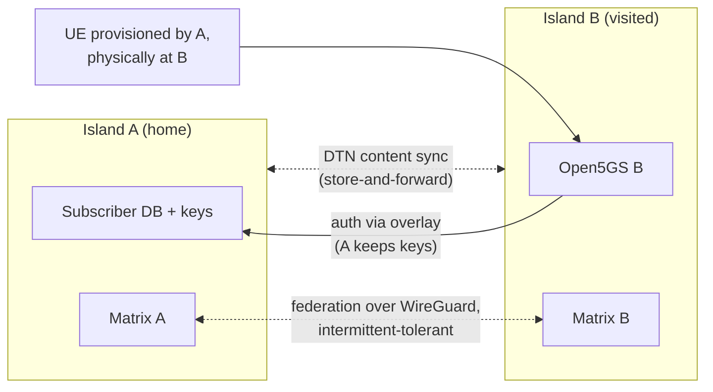

# stack/federation — inter-island federation (WBS 3.3, 4.1, 4.2)

This README frames the problem; the roaming mechanics are decided in [RFC-0003](../../rfcs/rfc-0003-roaming.md) (draft): home-routed authentication over the overlay, association allow-lists, bounded vector caching then guest provisioning under partition. Current state: [STATUS.md](../../STATUS.md).

## What federation must provide

1. **Subscriber roaming:** a SIM provisioned by island A works on island B, with A keeping key custody (RFC-0001 D4 — no central identity service).
2. **Messaging federation:** Matrix rooms spanning islands, tolerant of the inter-island link being down for hours/days.
3. **Content sync (DTN):** Kiwix/Kolibri library replication and store-and-forward when links are intermittent (WBS 4.2).



## Design questions for RFC-0003

- Home-routed authentication over the WireGuard overlay (visited AMF ↔ home UDM/AUSF) vs. periodic signed subscriber-set exchange (works while home island is unreachable, but weakens key custody). Likely answer: home-routed when the link is up, with an explicit, association-approved "refugee mode" fallback — needs a real security analysis, not a vibe.
- Overlay membership: how islands discover/trust each other (association-to-association key exchange ceremony? human-mediated, documented in the playbook).
- Matrix over intermittent links: what breaks in practice at hours-long partitions; candidate mitigations (queued federation sender tuning, or bridging over DTN transport).
- DTN transport choice for content: rsync-over-scheduled-links vs. NNCP vs. Syncthing — evaluate against multi-day partitions. <!-- VERIFY: current state of each -->

## Reproducing the two-island lab

`./two-island.sh {up|down|verify}` is the one-command way to run two islands on one host and prove the overlay works — this is what a partner lab (see [docs/partner-labs.md](../../docs/partner-labs.md) stage 3) runs before federating with a real second lab over the internet, and what a reviewer or [STATUS.md](../../STATUS.md) cites instead of a hand-run procedure.

```sh
cd stack/federation
./two-island.sh verify   # the whole thing, one command, cleans up after itself
```

What it does, in order: clones a second checkout for island B (`--b-dir <path>` to control where, default a gitignored directory next to this script); builds real signed identities for both islands (`island-init new --lab` for A, `new --file island.example.b.yaml` for B — never edits the committed fixtures); cross-peers *transient* copies of both islands' `island.yaml` (`federation.peers[]` populated with each other's real generated public key); renders and brings up both islands' `stack/core`; attaches island A's own UERANSIM UE (the 3.2-e "multi-rig" scenario: federating a second island must not disrupt an already-attached local subscriber); brings up both islands' `stack/federation`; runs `stack/federation/verify.sh` in both directions; confirms island A's UE is *still* attached; tears everything down.

`up` and `down` are the same flow split apart, for driving the two islands by hand (e.g. to poke around after `up`, or to build the partition drill on top of a running pair — WBS 4.1). Every check gates on live state (`docker compose exec` queries — `wg show`, `ip route`, an `ip addr`-derived attach check), never a log grep.

`./two-island.sh --log-level debug drill --ue oai` is WBS 4.1's partition drill (RFC-0003 D3, as corrected by that task): the same `up` + roaming attach as `roam --ue oai`, then, with both islands held up, it stops the visited island's `wg-overlay` (the link `verify.sh` tests) under the attached roamer and measures what survives (the established session does: B's own UPF anchors it), forces a fresh registration with the home island unreachable and prints B's AMF's own refusal line (B holds no key for the roamer, only its policy record), guest-provisions a local B subscriber for the same phone-analog and shows it registering and breaking out with the link still down, then restores the link and records how long until the original roamer is registered again. Every step prints its evidence and an `AS EXPECTED`/`DIFFERENT FROM EXPECTED` verdict; it tears down only at the end, with the same island-A-core guarantee as `down`. Operator-facing description: [playbook/drills.md](../../playbook/drills.md); measured results: [docs/poc-writeup.md](../../docs/poc-writeup.md) "Partition drill".

Both islands' `wg-overlay` containers reach each other over a dedicated simulated-WAN bridge (`compose.wan.yaml`, `10.200.0.0/24`, static addresses), not through the host's published ports — WBS 3.3-c v2f, fixing a Docker Desktop NAT-hairpin fault that otherwise black-holed the overlay (see `TASKS.md` 3.3-c v2e/v2f). `two-island.sh` owns that network's lifecycle; a standalone single-island deployment never sees it.

Real prerequisites: `pipx install ./sim-tools ./island-init` (same as [QUICKSTART.md](../../QUICKSTART.md)) and a Docker host with enough headroom for two full Open5GS cores plus two WireGuard containers at once.

## Status (3.3-a, 3.3-b)

3.3-a (`island.yaml`'s `node.internal_base`, a per-island `core_net`) is what makes the two-island lab possible at all — see [island-init/README.md](../../island-init/README.md) "Node-internal addressing" for how to bring two islands up on one host.

3.3-b adds the overlay module itself: `compose.yaml` brings up one `wg-overlay` container per island (see "Versions" below), rendered by `island-init` from `island.yaml`'s `island.overlay.address` (this island's own tunnel address) and `federation.peers[]` (RFC-0003 D2's allow-list — empty by default, an entry per trusted peer carrying its overlay pubkey, endpoint, `node_internal_base`, and `services_prefix`). `data/wg-up.sh` is the rendered script the container runs directly (an unmodified image, a different invocation — see its own header and `stack/core/compose.sim.yaml`'s `ue` service for the same pattern). It lives under gitignored `data/`, not tracked `config/` (3.3-b follow-up 1, the same 2.1-g reasoning as portal settings/LIS geometry): its content depends on `overlay.wireguard_public_key`, freshly random on every `island-init new`, so a tracked path would have `island.sh up` dirty the tree on a real instance's first render. `config/wg-up.example.sh` is the tracked golden-rule snapshot.

**Private key handling (the step-1 VERIFY marker, resolved):** `wg-up.sh` never contains the key. It brings `wg0` up via raw `ip link add` + `wg set wg0 private-key <file>` against a single mounted `secrets/<island-id>/wireguard.key`, read-only — `wg set` reads the file directly, so the plaintext key is never written into any rendered/templated file, not even transiently. Only that one file is mounted, never `secrets/` wholesale (the 2.1-f discipline the Island Console already follows). The trade-off against `wg-quick`: `wg-quick`'s own `.conf` format wants the key inline as text, which would mean either baking it into a rendered file (ruled out) or assembling a combined config at container-startup time (an extra moving part, still touching disk even if ephemeral) — `wg set` avoids both by taking a file path directly.

**A real constraint found live, not designed around in advance:** `core_net`'s `internal: true` (1.1-c's offline-first guarantee) turned out to block *any* bridged packet whose ultimate source or destination isn't itself a `core_net` member — including between two containers already on that same bridge, since Docker's bridge-netfilter subjects even intra-bridge traffic to this check. That ruled out routing a cross-island call through `wg-overlay` via `core_net` itself. The fix: `amf` (the only container that originates a cross-island SBI call) gets a *second* network membership on `services_net` (not `internal: true`) when a peer is allow-listed, and routes through `wg-overlay` there instead; `wg-overlay` masquerades tunnel-origin traffic to its own `core_net` address before it enters that bridge, so the destination NF's reply is directly routable back without needing a route of its own. Both changes are conditional on `federation.peers` being non-empty, so an unpeered island's `amf` is unchanged (golden rule holds).

**Verified live** (2026-09-14): a second local checkout (per the 3.3-a procedure), both islands' `stack/core` + `stack/federation` up simultaneously, real WireGuard keypairs generated (`island_init.crypto`) and cross-peered. All three 3.3-b acceptance checks passed in both directions:

1. From A's `amf`, B's NRF and UDM SBI ports (10.20.0.10:7777, 10.20.0.12:7777) answered over the tunnel, and the reverse (B → A) — `stack/federation/verify.sh` `ALL CHECKS PASSED` both ways.
2. Removing the peer from either side's `federation.peers`, re-rendering, and restarting that side's `wg-overlay` made the same SBI check fail (`Connection timed out`) — confirmed both directions.
3. Stopping `wg-overlay` on either island left `stack/core/verify.sh` passing unchanged on that island (`ALL CHECKS PASSED`, same UE/breakout addresses as always) — confirmed both islands.

## Versions

| Component | Version |
|---|---|
| WireGuard (`linuxserver/wireguard`) | `1.0.20250521` |
