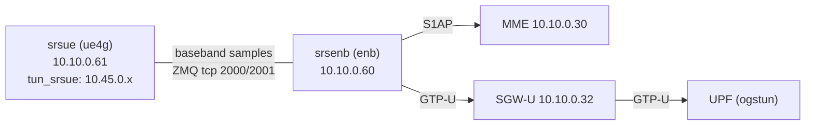
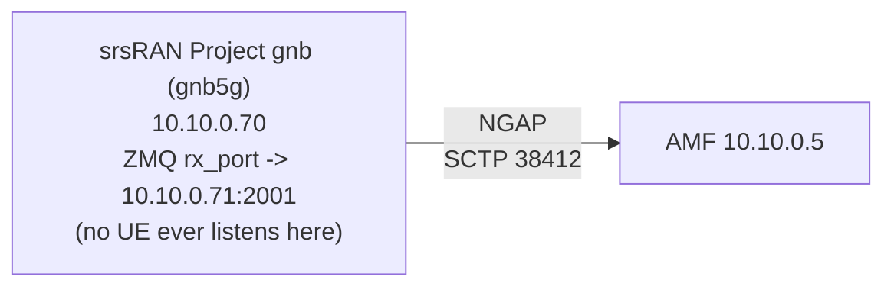
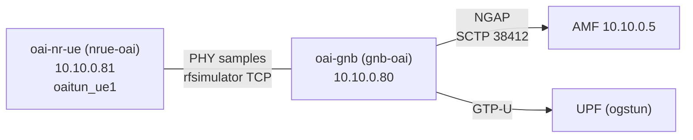

# stack/ran — radio access (WBS 1.2)

Real radio access for the island, in two lanes per [TASKS.md](TASKS.md): the
**ZMQ virtual radio** (`[SIM]` — no RF radiated, no license needed, the
default for all development) and the **SDR lane** (`[HW]` — only ever under
a test/local license or shielded enclosure; see the legal warning in
TASKS.md, which applies to everything in this directory).

Current state of every task here: [STATUS.md](../../STATUS.md).

## 4G ZMQ rig (compose.4g.yaml)



```bash
# stack/core must be up under its own compose project first
docker compose -f compose.4g.yaml up -d
./verify-4g.sh     # end-to-end: attach, IP, breakout ping, 5G regression
```

Verified passing on this machine (macOS Docker Desktop, amd64-emulated):
attach completes well within the script's poll window; breakout ping
UE→UPF ~40–50 ms under emulation. The script re-runs stack/core's
`verify.sh` at the end so a 4G change can never silently regress the 5G
path (that pairing is 1.1-d's acceptance criterion).

### Wiring notes (the non-obvious bits)

- **The eNB+UE pair lives and dies together.** Upstream's eNB ZMQ device
  args include `fail_on_disconnect=true`, so a UE restart leaves the eNB's
  sample stream dead. Always `docker compose -f compose.4g.yaml down && up
  -d` the pair — `verify-4g.sh` does this itself.
- **Static addresses, not service names**: the image's entrypoint writes
  ZMQ endpoints into the config by address before both peers resolve by
  DNS, so the compose file pins 10.10.0.60/61 on `core_net` (external,
  created by stack/core) and blanks the image's `*_HOSTNAME` defaults.
- **`ALGO=milenage` is set explicitly**: the image's env default is
  `mil`, which srsue rejects; upstream ue.conf's own default is
  `milenage`. (Candidate upstream fix in Gradiant/5g-images — noted per
  CLAUDE.md's upstream-first rule.)
- **The EPC side needs PCRF**: a 4G attach fails at CreateSession with
  SMF's `No Gx Diameter Peer` without one — that was the actual root
  cause of 1.1-d's original "partial" state, fixed in stack/core by
  adding `open5gs-pcrfd` + the Gx freeDiameter pair.
- The UE and the 1.1-b subscriber share the same public UERANSIM test
  vectors; IMSI assembles from env as MCC+MNC+MSISDN = `001010000000001`.
  Test values only — real keys never go in compose files (CLAUDE.md).

## 5G ZMQ rig (compose.5g.yaml) — negative finding



**Task 1.2-a step 1 asked for**: "Containerize srsRAN Project gNB ...
attached to the Open5GS AMF; pair with srsUE (also ZMQ) or UERANSIM UE as
appropriate." This was attempted honestly, with real containers on this
machine, not estimated. Result: **the gNB itself cannot be started at
all** by the current public image, for a reason that has nothing to do
with UE availability or with amd64 emulation being slow — it's a
reproducible packaging bug. That bug is the actual blocker; the missing
UE (documented below too) would be the *next* blocker if it were fixed.

### What was run

```bash
docker compose -f compose.5g.yaml up -d
./verify-5g.sh
```

`compose.5g.yaml` brings up only the gNB (`gradiant/srsran-5g:24_10_1`,
`DEVICE_DRIVER=zmq`, `DEVICE_ARGS=default`) against the real AMF at
`10.10.0.5:38412`, PLMN `001/01`, TAC `1` — otherwise following upstream's
own example config (`configs/gnb_rf_b200_tdd_n78_20mhz.yml`, band n78,
20 MHz, 30 kHz SCS) exactly as the 4G rig follows srsRAN_4G's.

### What actually happens

Reproduced repeatedly this session, on this machine (macOS/Apple Silicon,
Docker Desktop, amd64-emulated). The gNB binary never starts. On every
attempt:

```text
--== srsRAN gNB (commit ef4b0749a) ==--

Error parsing YAML configuration file: yaml-cpp: error at line 22, column 18: illegal map value
Run with --help for more information.
```

(exit code 103; the container then crash-loops under `restart:
unless-stopped`, one attempt every few seconds, forever, with the line
number climbing each time.)

**Root cause, traced into the image**: `gradiant/srsran-5g`'s
`entrypoint.sh`, when `DEVICE_DRIVER=zmq`, runs an `awk` pass that
inserts a `pdcch:`/`prach:` block into the config immediately after any
line matching `/tac:/` — intending to append it once, after `cell_cfg`'s
`tac:`. But srsRAN Project's own upstream template
(`gnb_rf_b200_tdd_n78_20mhz.yml`) legitimately contains **two** `tac:`
occurrences: one under `cell_cfg` (top-level, 2-space indent) and one
nested inside `cu_cp.amf.supported_tracking_areas` (a list item, deeper
indent). The awk script matches both and inserts the identical
2-space-indented block after each — corrupting the file the moment it
lands inside the nested list item, which is exactly what yaml-cpp's
"illegal map value" is reporting. This has nothing to do with our PLMN,
TAC, or any other env var we set: it reproduces with upstream's own
default values too, and the `awk` step runs unconditionally whenever
`DEVICE_DRIVER=zmq` — there is no combination of public env vars that
avoids it. Confirmed via the image's actual template file inside a
throwaway container, and confirmed the entrypoint script (checked via
[Gradiant/5g-images](https://github.com/Gradiant/5g-images) commit
history) has been unchanged since May 2024, so this affects every
published `srsran-5g` tag since then, `25_10` (current, Nov 2025)
included — not something specific to `24_10_1` or to this host.

**Per CLAUDE.md ("never fork upstreams"), this was not patched locally.**
The correct fix belongs upstream, in Gradiant/5g-images' `entrypoint.sh`
(scope the awk substitution to the `cell_cfg:` block only, not any line
containing `tac:`). Noted here for whoever files it; not yet filed as a
live issue.

### The second, independent problem: there is no UE to pair it with anyway

Even with the config bug fixed, `verify-5g.sh`'s register/IP/breakout
checks (the actual 1.2-a acceptance bar) would still be blocked, because
no ZMQ-capable 5G Standalone UE exists among this project's approved
upstreams:

- **srsRAN Project ships no UE application at all.** Its own repo
  description is "5G CU/DU solution"; the `apps/` tree has `cu`, `cu_cp`,
  `cu_up`, `du`, `du_low`, `gnb` — no `ue`. (The project has since
  transitioned to [OCUDU](https://ocudu.org) as of December 2025; the
  GitHub repo is archived but its tagged releases, including the one
  pinned here, remain intact and pullable.)
- The only UE ever shown paired with this gNB over ZMQ is in upstream's
  own CI (`.gitlab/ci/e2e/zmq_srsue.yml`): a `srsue` image pulled from a
  private CI registry (`RETINA_REGISTRY_PREFIX`), never published
  publicly.
- **`gradiant/srsran-4g`'s `ue` command's `SRSUE_5G=true` mode is EN-DC,
  not Standalone** — its own entrypoint still requires an LTE
  `[rat.eutra]` carrier (`dl_earfcn`) as anchor alongside the NR carrier.
  Gradiant's `enb` command has no matching NR-carrier option exposed at
  all, so even this EN-DC path has no counterpart eNB in the public
  images to pair with.
- **UERANSIM has no PHY/RF layer**, ZMQ or otherwise — its source tree is
  NAS/RRC message handling only (no `radio`/`zmq` code anywhere), so it
  cannot exchange baseband samples with a real gNB regardless of the
  above. It remains the right tool for 1.1-c's software-only core
  verification, not for this rig.

### What would actually resolve this

Either: (a) the upstream image bug gets fixed and someone builds/publishes
an open ZMQ-capable 5G SA UE (there isn't one today under this project's
approved-upstream list), or (b) skip ZMQ entirely and go straight to real
hardware — a USRP B210 for a genuine over-the-air attach with a COTS
phone (1.2-c), or a partner lab's testbed if one is available to this
project. Neither is a same-host software fix.

**Bottom line**: `verify-5g.sh` brings up the real Open5GS 5G core and
attempts the real gNB, and fails at the first real checkpoint (the gNB
process itself won't start) with a specific, traced, upstream cause —
not a vague "amd64 emulation is slow" shrug, and not a faked pass. See
[STATUS.md](../../STATUS.md) for how this is recorded.

## 5G-alt rig: OpenAirInterface over rfsimulator (compose.5g-oai.yaml) — positive finding



TASKS.md's follow-up task `1.2-a(5G-alt)`: with the srsRAN 5G ZMQ rig
blocked by an upstream packaging bug and no ZMQ-capable 5G SA UE available
among approved upstreams (see the negative finding below), OpenAirInterface
— itself an approved upstream alternative (RFC-0001 D1, `docs/landscape.md`)
— was tried instead, over its own software-radio loopback (`rfsimulator`,
OAI's equivalent of ZMQ virtual radio) against the same real Open5GS 5GC.
**Unlike the srsRAN attempt, this one meets 1.2-a's acceptance criteria for
real:**

```bash
docker compose -f compose.5g-oai.yaml up -d   # core must be up first
./verify-5g-oai.sh
```

Run twice on this machine (macOS, Apple Silicon, Docker Desktop) from a
fully torn-down state, both times `ALL CHECKS PASSED` in ~25s: NAS
registration completes, the PDU Session Establishment Accept carries a
`10.45.0.0/16` address, `oaitun_ue1` comes up with it, and the local
breakout ping to the services subnet (10.46.0.2) succeeds at ~7-9 ms RTT
— then `verify-5g-oai.sh` delegates to stack/core's own `verify.sh`, which
re-registers UERANSIM's UE and passes its own full check suite, proving
the OAI rig doesn't regress the primary path.

### Two real problems hit and fixed along the way (not invented, not glossed over)

1. **`docker compose logs <service> | grep` is not a reliable pass/fail
   gate on this host, checked from a script.** The exact same Docker
   Desktop log-delivery quirk already documented below against `gnb5g`
   reproduced again here: the nr-ue's "TUN Interface oaitun_ue1
   successfully configured" line was confirmed (via `docker logs -t`) to
   have been written to the log **under 2 seconds** after container
   start, yet a script polling `docker compose logs nrue-oai | grep` every
   2s for up to 120s twice failed to ever see it — while a manual,
   interactive re-run of the identical grep immediately afterward matched
   instantly. `verify-5g-oai.sh`'s check 1 therefore polls the container's
   *live* network state (`exec ip addr show oaitun_ue1`, freshly queried
   each iteration) as the actual gate, and only uses the log line as
   best-effort corroboration once the real state already confirms success
   — this is the same principle verify-5g.sh below already applies
   (`docker inspect` over `docker logs`), just against a different
   symptom of the same underlying flakiness.
2. **Reusing the shared test IMSI (`001010000000001`) broke the GTP-U data
   path for real.** `sim-tools`' `db sync` does a full reconcile via
   Mongo `replaceOne` even when the IMSI is unchanged; replacing that
   subscriber document out from under a UE with an *actively established*
   PDU session left Open5GS's SMF/UPF in a state where the next
   registration under the same IMSI reported success (NAS Registration
   Complete, PDU Session Establishment Accept, IP assigned) but the UPF
   genuinely could not route to the UE afterward — confirmed directly with
   `docker compose exec upf ping <ue-ip>` (100% loss), reproduced twice.
   The fix was giving the OAI rig its own dedicated test IMSI
   (`001010000000002`, same well-known test K/OPc — see
   `config/nrue.uicc.yaml`) instead of sharing one with every other rig;
   `verify-5g-oai.sh`'s header comment has the full trace. This is a real,
   reproducible Open5GS/sim-tools interaction worth keeping in mind for
   any future rig that provisions its own subscriber — not specific to OAI.

### Wiring notes for the OAI rig (the non-obvious bits)

- **Config is two mounted YAML files, not env-var templating.** OAI's
  images (`oaisoftwarealliance/oai-gnb`, `oaisoftwarealliance/oai-nr-ue`)
  take `-O <configfile>`; the entrypoint looks for
  `/opt/oai-{gnb,nr-ue}/etc/{gnb,nr-ue}.yaml` if mounted, otherwise a
  `.conf` twin — confirmed by reading the actual entrypoint script inside
  each pinned image. `config/gnb.sa.rfsim.yaml` and
  `config/nrue.uicc.yaml` are upstream's own CI reference config for band
  n78/106 PRB/rfsimulator (`openairinterface5g`
  `ci-scripts/conf_files/gnb.sa.band78.106prb.rfsim.yaml` +
  `nrue.uicc.yaml`, `develop` branch) with only PLMN, AMF/gNB addresses,
  and the UE's subscriber/DNN fields swapped for this project's core — see
  each file's header comment for the exact diff.
- **No `platform: linux/amd64` pin, unlike every other rig here.**
  `docker buildx imagetools inspect` against the pinned tag confirms both
  `oai-gnb` and `oai-nr-ue` publish real `linux/arm64` manifests alongside
  `linux/amd64` — verified, not assumed. Forcing amd64 here would only add
  emulation overhead for no portability gain; the compose file's own
  header comment explains this.
- **PLMN `001/01` encodes as `mcc: 1, mnc: 1, mnc_length: 2` in OAI's YAML
  schema**, not string `"001"`/`"01"` — confirmed against OAI's own
  `tests/nr-ue-nas-simulator/nr-ue-nas-simulator.c` defaults, which use the
  identical encoding for the identical PLMN.
- **DNN is `internet`, not OAI's own CI default of `oai`** — Open5GS's
  SMF/UPF here have no explicit DNN configured, which resolves to
  `internet` (see `stack/core/config/smf.yaml` and
  `sim-tools/resccom_sim/sync.py`'s `DEFAULT_APN`), and `--nas.apn=internet`
  is exactly what compose.4g.yaml's srsue already requests for the same
  reason.

## Versions

| Component | Image | Tag | Notes |
|---|---|---|---|
| srsRAN 4G | `gradiant/srsran-4g` | `23_11` | Community image (Apache-2.0, [Gradiant/5g-images](https://github.com/Gradiant/5g-images)) building unmodified upstream [srsRAN_4G release_23_11](https://github.com/srsran/srsRAN_4G); ZMQ device enabled. `linux/amd64` only — pull/run with an explicit platform on arm64 hosts. A newer `25_10` tag exists but 23_11 is the long-standing, widely documented ZMQ release. <!-- VERIFY: revisit when srsRAN_4G cuts a new release --> |
| srsRAN 5G (gNB only) | `gradiant/srsran-5g` | `24_10_1` | Community image (Apache-2.0, Gradiant/5g-images) building unmodified upstream [srsRAN Project release_24_10_1](https://github.com/srsran/srsRAN_Project) — CU/DU/gNB only, no UE (see "negative finding" above). `linux/amd64` only. Blocked in ZMQ mode by a packaging bug in every tag since 2024 including the current `25_10`; kept pinned at `24_10_1` as the tag this was reproduced against. srsRAN Project itself transitioned to [OCUDU](https://ocudu.org) in Dec 2025 — its GitHub repo is archived but tagged releases remain pullable/buildable. <!-- VERIFY: revisit if Gradiant/5g-images fixes the ZMQ entrypoint bug, or if an OCUDU-based image appears --> |
| OAI gNB | `oaisoftwarealliance/oai-gnb` | `2026.w37` | Official [OpenAirInterface](https://openairinterface.org) image (MIT-licensed entrypoint per the image's own `SPDX-License-Identifier`; builds unmodified upstream [`openairinterface5g`](https://github.com/OPENAIRINTERFACE/openairinterface5g) `develop` branch at that week's snapshot) — the project publishes weekly `YYYY.wWW` tags rather than a maintained semver line for these images (a `v2.3.0` tag exists but is far older than the weekly line per Docker Hub's `last_updated`); `2026.w37` (2026-09-12) was the newest tag at the time this was pinned, matched to the same week's `oai-nr-ue` tag since gNB/UE version skew is a documented OAI interop hazard. Publishes real `linux/arm64` manifests alongside `linux/amd64` (verified via `docker buildx imagetools inspect`, not assumed) — no platform pin needed. <!-- VERIFY: revisit weekly tag pin periodically; check for a semver release resuming --> |
| OAI nrUE | `oaisoftwarealliance/oai-nr-ue` | `2026.w37` | Same image family/licensing/versioning scheme as OAI gNB above; pinned to the identical week's tag for the same reason. |
