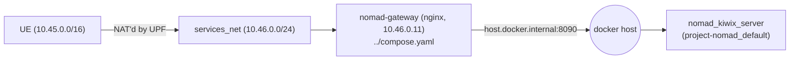

# stack/services/nomad — Project NOMAD (1.3-b)

[Project NOMAD](https://github.com/Crosstalk-Solutions/project-nomad)
(Apache-2.0), unmodified, deployed here as the island's knowledge library —
`library.island` today; `learn.island`/`maps.island` are reserved for its
Kolibri and ProtoMaps apps once a later task installs them (see "What's
installed" below).

## What NOMAD actually is (and why the compose file looks like this)

NOMAD isn't one container — it's a small management app (the "Command
Center": `admin` + MySQL + Redis here) that holds its OWN Docker socket
and creates *sibling* containers for each app you enable (Kiwix, Ollama,
Kolibri, ...), entirely outside of any compose file. That has two
consequences this task had to design around:

1. **The admin needs `/var/run/docker.sock`.** It has the same control
   over this host's Docker daemon as anything else with socket access —
   there is no sandboxing narrower than that upstream offers. That's
   NOMAD's own design, not something we chose or could narrow without
   forking it; SECURITY.md's threat model should treat this host the way
   it treats any host running admin-privileged software.
2. **Child app containers (Kiwix, etc.) always join NOMAD's own default
   network** (`project-nomad_default`) and publish straight to the host
   (Kiwix: `8090`) — the code that decides this
   (`app/services/docker_service.js`'s `NOMAD_NETWORK` constant) has no
   config knob to point it at `services_net` instead. Forking that file
   to redirect it would violate CLAUDE.md's "never fork upstreams" rule
   as much as patching Open5GS would. See "How .island names reach NOMAD"
   below for how this project bridges the two networks without touching
   NOMAD's code at all.

Everything else in `compose.yaml` is upstream's own
`install/management_compose.yaml`, version-pinned and reduced to the
services the admin actually depends on to start (`admin`, `mysql`,
`redis`) — `dozzle` (log viewer), `updater` (in-UI self-update) and
`disk-collector` (host disk-usage display) are upstream-labeled optional
conveniences we don't need, and `updater` in particular would let the
admin drift off the version pin silently. See `compose.yaml`'s own header
comment for the storage-mount adaptation (a real bind mount is load-
bearing here, not a convenience — a named volume breaks the sibling-
container storage sharing NOMAD depends on; verified live, see "What we
hit" below).

## How .island names reach NOMAD



`library.island`/`learn.island`/`maps.island` all resolve to
`10.46.0.11` (`../config/coredns/island.zone`, from 1.3-a) — the
`nomad-gateway` nginx container defined in `../compose.yaml`, **not**
anything in this directory. It proxies to Kiwix's host-published port
over `host.docker.internal`, which is the only address any container on
`services_net` needs to reach anything NOMAD manages — nothing in
`stack/core`, CoreDNS, or the UE ever needs to know `project-nomad_default`
exists. That's the entire "glue is only networking + DNS" boundary for
this task: NOMAD is never modified, and nothing it manages is ever
attached to `services_net` directly.

This also means `docker compose down` here does **not** stop or remove
`nomad_kiwix_server` (or any other installed app) — it's a plain Docker
container the admin created directly, invisible to this compose project
entirely. Bringing NOMAD back up won't recreate it either (the admin
finds it already running via the Docker API). Only `docker compose down
-v` here, which drops the MySQL volume holding NOMAD's own "installed
services" record, would leave it orphaned with nothing tracking it —
remove it by hand (`docker rm -f nomad_kiwix_server`) if you ever do that.

## Bring-up

```bash
cd stack/services/nomad
cp nomad.example.env .env   # then edit every value — see the file's own comments
docker compose up -d
docker compose logs admin   # wait for "started HTTP server on 0.0.0.0:8080"
```

Install Kiwix and preload the one small demo ZIM NOMAD itself ships
(`wikipedia_en_100_mini`, ~4.5 MB — this is what 1.3-b's "e.g. Wikipedia
top-100" wording refers to; NOMAD bundles it as Kiwix Serve's own
pre-install step, not something this task downloads separately):

```bash
curl -s -X POST http://localhost:8080/api/system/services/install \
  -H 'Content-Type: application/json' -d '{"service_name":"nomad_kiwix_server"}'
```

Confirm: `curl -s http://localhost:8080/api/zim/list` lists the one ZIM;
`docker ps` shows `nomad_kiwix_server` published on host port `8090`.

## How associations choose/load full libraries

The demo ZIM above is deliberately minimal. For a real deployment, an
association picks content through the Command Center UI
(`http://<node>:8080` → Information Library) or the same HTTP API used
above:

- **`GET /api/zim/wikipedia`** lists NOMAD's curated Wikipedia editions by
  size (`top-mini` 331 MB up to `all-maxi` full Wikipedia with images at
  ~124 GB); **`POST /api/zim/wikipedia/select {"optionId": "..."}`**
  downloads and swaps in one of them, replacing whichever edition (if
  any) is currently selected.
- **`GET /api/zim/curated-categories`** lists topic packs (Medicine, and
  others) at multiple tiers (Essential/Standard/Comprehensive), each a
  named list of individually-sized Kiwix ZIMs — useful for associations
  that want, say, offline medical references without the rest of
  Wikipedia.
- **`POST /api/zim/download-remote`** accepts any direct ZIM URL, for
  content outside NOMAD's curated lists (e.g. a region-specific ZIM from
  [library.kiwix.org](https://library.kiwix.org)).
- All of the above land in the same shared storage directory
  (`$NOMAD_DATA_DIR/storage/zim`) and get picked up by
  `nomad_kiwix_server` automatically — no restart needed in the common
  case (`KiwixLibraryService` rebuilds `library.xml` and Kiwix reloads it
  live; only a legacy pre-library-mode Kiwix container, not relevant to a
  fresh 1.3-b install, needs a restart).

Sizing content against the node's actual disk is an operational decision
per `node-hw/` class, not something this task fixes a default for.

## Layout

- `compose.yaml` — `admin` + `mysql` + `redis`, upstream's own images.
- `nomad.example.env` — checked-in template for `.env` (gitignored; real
  secrets and the required absolute `NOMAD_DATA_DIR` path never committed).
- `data/` — gitignored (root `.gitignore`'s blanket `data/` rule); this is
  where `$NOMAD_DATA_DIR` points by default. Holds real ZIM content, so
  size expectations follow whatever libraries get installed.

The nginx proxy that actually answers `library.island` etc. lives in
`../compose.yaml` / `../config/nomad-gateway/`, not here — see "How
.island names reach NOMAD" above for why.

## Versions

| Component | Image | Tag | Notes |
|---|---|---|---|
| Project NOMAD | `ghcr.io/crosstalk-solutions/project-nomad` | `v1.34.1` | `linux/amd64` only as of this writing. |
| MySQL | `mysql` | `8.0.43` | Backing DB for the admin app. |
| Redis | `redis` | `7.4.5-alpine` | Cache/queue backing for the admin app. |
| Kiwix Serve | `ghcr.io/kiwix/kiwix-serve` | `3.8.1` | Chosen and pulled by NOMAD itself (`nomad_kiwix_server`'s `container_image`, confirmed via `GET /api/system/services`), not pinned in this repo's own compose files — that's NOMAD's own install logic to version, per "never fork upstreams". |

<!-- VERIFY: re-check the project-nomad tag periodically; its GitHub
releases page is the source of truth. Kiwix Serve's tag is NOMAD's own
choice and may change independently of anything in this repo. -->

## Known limitations / design notes

- **Docker socket exposure.** See "What NOMAD actually is" above — this
  is upstream's own architecture, not a gap introduced here.
- **`nomad_kiwix_server` isn't compose-managed.** See "How .island names
  reach NOMAD" above.
- **`learn.island`/`maps.island` currently proxy to Kiwix too.** Neither
  Kolibri (education) nor ProtoMaps (maps) is installed by this task —
  only Kiwix, per 1.3-b's own scope ("preload one small Kiwix ZIM").
  `../config/nomad-gateway/nginx.conf` has a comment marking where to
  split this out once those land.
- **`nomad-gateway` proxies unconditionally to Kiwix's host port**,
  regardless of hostname (`library`/`learn`/`maps`.island all currently
  hit the same upstream) — see the same nginx.conf comment.
- **No real "WAN down" test performed** (same caveat as 1.3-a's README):
  not attempted on this dev host. Unlike 1.3-a's DNS forwarder, this
  path structurally cannot depend on WAN either way — `host.docker.internal`
  resolves to the local docker host regardless of its internet
  reachability, and Kiwix serves the ZIM from local disk — so there's no
  code path here that WAN state could affect. Verified instead: the ZIM
  content itself renders correctly end-to-end (see "Verification
  performed").

## Verification performed

Deployed `admin`+`mysql`+`redis` on this machine (macOS + Docker Desktop,
`linux/amd64` emulation for `admin`). First attempt used a named Docker
volume for `/app/storage` instead of a host bind mount, following
`stack/core`'s `mongo-data` convention — this **failed**: installing
`nomad_kiwix_server` errored with `mounts denied: /opt/project-nomad/storage/zim
is not shared from the host`, because Docker Desktop's file-sharing
allowlist doesn't cover a named volume's Docker-internal mountpoint, and
the admin bind-mounts that same host path into every child container it
creates. Switched to a real bind mount under `./data/` (gitignored) and
the install succeeded immediately after.

Confirmed via the API: `nomad_kiwix_server` installed, `status: running`,
`ui_location: 8090`; `docker ps` shows it published on host port `8090`
(image `ghcr.io/kiwix/kiwix-serve:3.8.1`); `GET /api/zim/list` shows
exactly one ZIM, `wikipedia_en_100_mini_2026-01.zim` (4.5 MB).

From the UERANSIM UE (after the same `10.46.0.0/24` route as 1.3-a, plus
pointing its `/etc/resolv.conf` at `10.46.0.53` so plain `curl
http://library.island` resolves without `--resolve`, matching how a real
device would have DNS pushed via PCO): `curl http://library.island/`
→ `200`, Kiwix's own landing page; `curl http://library.island/content/
wikipedia_en_100_mini_2026-01/Antarctica` → `200`, real article HTML
(`<title>Antarctica</title>`). `learn.island` and `maps.island` also
→ `200` (same content, see "Known limitations" above for why).

One unrelated flake surfaced during this work and is worth recording:
partway through, the long-lived UERANSIM UE/gNB pair from 1.3-a's earlier
testing lost its NGAP/PDU-session state (gNB logged `AMF selection...
failed`, `PDU session not found`) while its interface still showed a
route — recreating the pair (`docker compose ... rm -f gnb ue && ... up
-d gnb ue`) fixed it in one cycle. This matches the project's existing
"ZMQ pair restarts" quirk category for long-running simulator containers;
unrelated to anything built in 1.3-b.
